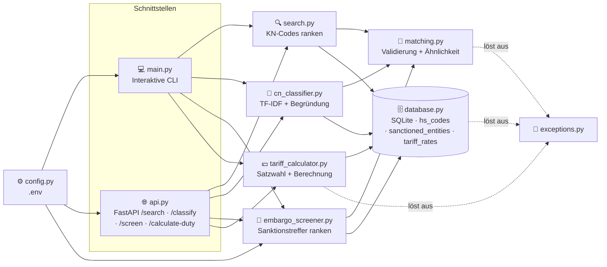
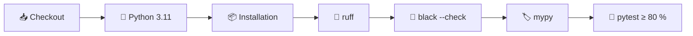

<div align="center">

# 🛃 CustomsIQ

### Compliance-Toolkit für Zoll- und Außenhandelsprozesse
**Waren unter der richtigen HS-/KN-Codenummer einreihen, Geschäftspartner gegen Sanktionslisten
prüfen und den fälligen Zoll berechnen.**

[](https://github.com/Mutersec/CustomsIQ/actions/workflows/ci.yml)


**[🌐 Live-Demo](https://customsiq-gs0u.onrender.com/)** · [📖 API-Referenz](https://customsiq-gs0u.onrender.com/docs)

<sub>Läuft auf einer kostenlosen Render-Instanz, die im Leerlauf schläft — die erste Anfrage kann ~30 s dauern.</sub>

[🇬🇧 English](README.md) · [🇹🇷 Türkçe](README.tr.md) · **🇩🇪 Deutsch**

</div>

---

> **ℹ️ Zum Demo-Datenbestand.** Die Live-Demo läuft auf einem kleinen, kuratierten Datenbestand
> (20 HS-Codes), damit die Kaltstarts auf Renders kostenloser Stufe kurz bleiben — dort wird das
> Dateisystem bei Inaktivität zurückgesetzt. Die Importstrecke ist end-to-end gegen realistische
> Daten im KN-Format verifiziert (siehe
> [Import der echten KN-Nomenklatur](#import-der-echten-kn-nomenklatur) weiter unten) — führt man
> sie lokal gegen den vollständigen EU-Datenbestand oder auf einem Deployment mit persistenter
> Platte aus, füllt sie dasselbe Schema, das auch die Live-Demo nutzt.

---

## 📑 Inhaltsverzeichnis

| | | |
|---|---|---|
| [🎯 Problemstellung](#-problemstellung) | [✨ Funktionen](#-funktionen) | [🏗️ Architektur](#️-architektur) |
| [🧠 Designentscheidungen](#-designentscheidungen) | [⚙️ Einrichtung](#️-einrichtung) | [🚀 Verwendung](#-verwendung) |
| [🌐 API-Referenz](#-api-referenz) | [🧪 Qualität und Tests](#-qualität-und-tests) | [📦 Beispieldaten](#-beispieldaten) |
| [🗺️ Roadmap](#️-roadmap) | [📁 Projektstruktur](#-projektstruktur) | [📄 Lizenz](#-lizenz) |

---

## 🎯 Problemstellung

Die Zuordnung der korrekten **KN-Codenummer** (der EU-*Kombinierten Nomenklatur*, die den
internationalen HS-Code auf 8 Stellen und im TARIC auf 10 Stellen erweitert) gehört zu den
langsamsten und fehleranfälligsten Schritten einer Zollanmeldung. Heute geschieht sie manuell —
anhand eines Zolltarifs mit Zehntausenden von Zeilen.

| Schwachstelle | Betriebswirtschaftliche Folge |
|---|---|
| 🔍 Manuelle Suche in einem riesigen Zolltarif | Langsame Anmeldungen; das Ergebnis hängt davon ab, wer gerade Schicht hat |
| ❌ Fehlerhafte Tarifierung | Falscher Zollsatz, Bußgelder, festgehaltene Sendungen |
| 🧠 Wissen steckt in den Köpfen Einzelner | Lange Einarbeitung, keine prüffähige Begründung für den gewählten Code |

**CustomsIQ automatisiert den ersten Durchgang:** Sie geben eine alltagssprachliche
Produktbeschreibung ein und erhalten eine nach Ähnlichkeitswert sortierte Vorauswahl an
Tarifnummern — ein Ausgangspunkt, den eine Fachkraft bestätigt, und keine Blackbox, die allein
entscheidet.

---

## ✨ Funktionen

| | Funktion | Beschreibung |
|---|---|---|
| 🔍 | **Unscharfe Suche** | Freitextbeschreibung → nach Ähnlichkeitswert sortierte KN-/TARIC-Codes |
| 🧠 | **Code-Einreihung** | TF-IDF-Vorschläge mit Konfidenzwert und den ausschlaggebenden Begriffen |
| 🚫 | **Sanktionsprüfung** | Name → Treffer auf Verbotslisten, tolerant gegenüber Wortstellung und Teilnamen |
| 💶 | **Zollberechnung** | Code + Ursprung + Wert → fälliger Zoll, mit Satz und Begründung |
| 🖥️ | **Weboberfläche** | Single-Page-Frontend unter `/` — ohne Build-Schritt, Framework oder CDN |
| 📥 | **Import echter Daten** | Lädt die offizielle EU-KN-Nomenklatur idempotent aus einer lokalen Datei |
| 💻 | **Interaktive CLI** | Codes suchen oder `screen <Name>` am selben Prompt ausführen |
| 🌐 | **REST-API** | `GET /search` und `GET /screen` über FastAPI, mit erzeugter `/docs`-Oberfläche |
| 🗄️ | **Speicherung ohne Einrichtungsaufwand** | SQLite aus der Standardbibliothek, vorbefüllt mit 20 Codes + 18 fiktiven Einträgen |
| ⚙️ | **Konfiguration über Umgebung** | `pydantic-settings` liest `.env` — keine fest codierten Pfade oder Schwellenwerte |
| 🚨 | **Typisierte Fehler** | `InvalidQueryError`, `HSCodeNotFoundError` → saubere HTTP-`400`/`404`-Semantik |
| 🧪 | **Erzwungene Qualität** | ruff + black + mypy + 98 % Testabdeckung, bei jedem Push in der CI geprüft |

---

## 🏗️ Architektur

Zwei Funktionen — **KN-Code-Suche** und **Sanktionsprüfung** — setzen auf einer gemeinsamen
Matching-Schicht auf. CLI und HTTP-API sind dünne Adapter über `search()` und `screen_entity()`;
Scoring- und Validierungslogik existiert an genau einer Stelle und wird nie dupliziert.



### Zuständigkeiten der Module

| Modul | Zuständigkeit |
|---|---|
| `models.py` | `HSCode`, `SanctionedEntity` und `TariffRate` — die unveränderlichen Datensätze |
| `database.py` | SQLite-Schema, Verbindung, Beispieldaten, `fetch_all*()`, `get_by_code()` |
| `matching.py` | Eingabevalidierung + Ähnlichkeitsbewertung (**von beiden Funktionen genutzt**) |
| `search.py` | Rankt KN-Codes nach Beschreibungsähnlichkeit |
| `cn_classifier.py` | Schlägt Codes über TF-IDF-Gewichtung vor und nennt die passenden Begriffe |
| `embargo_screener.py` | Rankt Sanktionslistentreffer nach Namensähnlichkeit |
| `tariff_calculator.py` | Wählt den anwendbaren Zollsatz und berechnet den fälligen Betrag |
| `exceptions.py` | `CustomsIQError` → `InvalidQueryError`, `HSCodeNotFoundError`, `RateNotFoundError` |
| `config.py` | `pydantic-settings`; liest `CUSTOMSIQ_*`-Umgebungsvariablen und `.env` |
| `logging_config.py` | Gemeinsames Logging — schlichtes Format nach stdout, nirgends ein `print()` |
| `main.py` | Einstiegspunkt der interaktiven CLI (Suche + `screen <Name>`) |
| `api.py` | FastAPI-Anwendung: liefert das Frontend unter `/`, dazu `/search`, `/classify`, `/screen`, `/calculate-duty`, `/health` |
| `static/index.html` | Das gesamte Frontend — Inline-CSS, reines `fetch()`, keine Abhängigkeiten |

### Datenmodell

```sql
CREATE TABLE hs_codes (
    code        TEXT PRIMARY KEY,   -- z. B. "6109100000"
    description TEXT NOT NULL,      -- z. B. "Cotton T-shirts, knitted"
    category    TEXT NOT NULL       -- z. B. "Textile"
);

CREATE TABLE sanctioned_entities (
    name        TEXT PRIMARY KEY,   -- z. B. "Northwind Maritime Holdings Ltd"
    country     TEXT NOT NULL,      -- ISO 3166-1 alpha-2, z. B. "CY"
    list_source TEXT NOT NULL,      -- z. B. "EU Consolidated Financial Sanctions List"
    date_added  TEXT NOT NULL       -- ISO-8601-Datum, z. B. "2023-04-12"
);

CREATE TABLE tariff_rates (
    hs_code           TEXT NOT NULL,  -- z. B. "6109100000"
    country_of_origin TEXT NOT NULL,  -- ISO alpha-2, oder "ALL" für den Regelsatz (MFN)
    rate_type         TEXT NOT NULL,  -- "standard" oder "preferential"
    rate_percent      REAL NOT NULL,  -- z. B. 12.0
    trade_agreement   TEXT,           -- NULL bei Regelsätzen
    valid_from        TEXT NOT NULL,  -- ISO-8601-Datum des Inkrafttretens
    PRIMARY KEY (hs_code, country_of_origin, valid_from)
);
```

---

## 🧠 Designentscheidungen

### Warum `difflib` statt `rapidfuzz` / `thefuzz`?

`difflib.SequenceMatcher` ist Teil von Python. Das bedeutet **keine zusätzliche Abhängigkeit**,
nichts zu pinnen oder sicherheitstechnisch zu prüfen, keine Installationshürde — und es genügt beim
derzeitigen Datenvolumen vollkommen.

| | `difflib` *(gewählt)* | `rapidfuzz` |
|---|---|---|
| **Abhängigkeit** | ✅ Standardbibliothek | ⚠️ Drittanbieter + C-Erweiterung |
| **Geschwindigkeit bei ~10² Zeilen** | ✅ Nicht wahrnehmbar | ✅ Nicht wahrnehmbar |
| **Geschwindigkeit bei ~10⁵ Zeilen** | ❌ Spürbar langsam | ✅ C-optimiert, deutlich schneller |
| **Toleranz gegenüber Wortstellung** | ❌ Nur positionsbasierter Abgleich | ✅ `token_sort`- / `token_set`-Scorer |
| **Durchsatz bei Massenverarbeitung** | ❌ Reines Python | ✅ `process.extract`, mehrkernfähig |

### 🔀 Wann der Wechsel ansteht

Ersetzen Sie `similarity()` in `matching.py` durch `rapidfuzz.fuzz.WRatio`, sobald **einer** dieser
Punkte zutrifft:

1. **📈 Datenvolumen** — der reale Zolltarif (Zehntausende Zeilen) macht den linearen Durchlauf messbar langsam.
2. **🔤 Wortstellung** — Abfragen wie *„Hose Baumwolle Herren“* sollen *„Men's cotton trousers“* treffen; positionsbasierter Abgleich leistet das schlecht.
3. **⚡ Durchsatz** — ein Stapellauf zur Neutarifierung benötigt Tausende Abfragen pro Sekunde.

> Der Austausch beschränkt sich auf **eine einzige Funktion**. Die Entscheidung bleibt damit
> günstig und lässt sich später treffen — sie ist keine Festlegung, die heute nötig wäre.

### Weitere bewusste Entscheidungen

| Entscheidung | Begründung | Ausbaupfad |
|---|---|---|
| **SQLite statt PostgreSQL** | Referenzdaten auf einem Knoten, überwiegend lesend; kein Betriebsaufwand | Verbindungsschicht austauschen, sobald mehrere Schreiber nötig werden |
| **Eine gemeinsame Verbindung** mit `check_same_thread=False` | Einfach und mit dem Threadpool von FastAPI verträglich | Verbindungspool, sobald parallele Schreibzugriffe auftreten |
| **Logging statt `print()`** | Derselbe Ausgabeweg für CLI und API; Level über die Konfiguration steuerbar | — |
| **Validierung in `matching.py`** | Suche, Prüfung, CLI und API erben sie; ein neuer Aufrufer kann sie nicht versehentlich umgehen | — |
| **Kein `EmbargoScreeningError`** | Die Eingabevalidierung der Prüfung ist identisch mit der der Suche, daher wird `InvalidQueryError` wiederverwendet statt eine Klasse zu duplizieren | Ergänzen, sobald die Prüfung einen wirklich eigenen Fehlerfall bekommt |

### 🧠 `/search` vs. `/classify` — ein Datenbestand, zwei Algorithmen

Beide ranken dieselbe `hs_codes`-Tabelle, beantworten aber verschiedene Fragen und scheitern
verschieden. `/search` ist ein **Nachschlagen**: schneller Zeichenabgleich, gut wenn man die
Formulierung ungefähr kennt. `/classify` ist eine **Vorschlagsmaschine**: sie gewichtet, wie
*selten* jedes Wort im Datenbestand ist, sodass ein kennzeichnender Begriff mehr zählt als ein
häufiger — und sie nennt, welche Ihrer Begriffe den Treffer bewirkt haben.

Am Beispieldatenbestand gemessen:

| Abfrage | `/search` (difflib) | `/classify` (TF-IDF) | |
|---|---|---|---|
| `knitted cotton shirt` | `6203420000` Herren**hosen** aus Baumwolle | `6109100000` **T-Shirts aus Baumwolle, gewirkt** | ✅ classify richtig |
| `lithium battery` | `8507600000` Lithium-Ionen-Akkus | dasselbe | unentschieden |
| `laptop` | `3926909700` Haushaltsartikel aus Kunststoff | `8471300000` Notebooks | ✅ classify richtig |

Zeile 1 ist der Fall, der dieses Modul rechtfertigt: `knitted` kommt in nur einer Beschreibung vor,
also lässt die Begriffsgewichtung es dominieren, während der Zeichenabgleich von der Masse der mit
"cotton trousers" geteilten Buchstaben in die Irre geführt wird. Zeile 3 zeigt den umgekehrten
Fehler: difflib liefert immer *irgendetwas*, `/classify` dagegen nichts, wenn kein Begriff geteilt
wird — statt Rauschen als Vorschlag auszugeben.

**Warum handgeschriebenes TF-IDF und nicht scikit-learn.** Implementiert ist sklearns eigene Formel
(geglättetes IDF `log((N+1)/(df+1))+1`, L2-normalisierte Vektoren, Kosinus über das Skalarprodukt)
in ~40 Zeilen Standardbibliothek-Arithmetik; `TfidfVectorizer` würde diese Daten also nahezu
identisch ranken — es gibt keine Genauigkeitslücke zu schließen. Dagegen zieht scikit-learn numpy
und scipy (~100 MB) ins Produktions-Image, um eine 20-zeilige Tabelle zu ranken. Und entscheidend:
**Erklärbarkeit würde mit sklearn mehr Code kosten, nicht weniger** — hier ist der Beitrag jedes
Begriffs `Abfragegewicht × Dokumentgewicht`, ohnehin auf dem Weg zum Score berechnet; mit sklearn
müsste man in `vectorizer.vocabulary_` greifen und in eine dünnbesetzte Matrix zurückindizieren.

Zu scikit-learn wechseln, sobald der Bestand ~10⁵ Zeilen übersteigt oder n-Gramme bzw. sublineare
Termfrequenz nötig werden. Davor wird der Index pro Aufruf neu aufgebaut — 0,1 ms bei 20 Codes,
~68 ms bei 10 000 — die erste Optimierung ist also Zwischenspeichern, keine neue Abhängigkeit.

**Ein gemessenes Detail:** KN-Beschreibungen stehen im Plural ("cables", "batteries"), Nutzer tippen
den Singular. Ohne Pluralfaltung erzielten `cable`, `biscuit`, `laptop` und `battery` jeweils **null
gegen jeden Code**. Der Tokenizer faltet daher `-ies → y`, das sibilantische `-es` und `-s`. Kein
Stemmer — nur die englische Pluralregel, die der Datenbestand verlangt.

### 🚫 Namensabgleich ist kein Produktabgleich

Die Sanktionsprüfung nutzt aus Konsistenzgründen denselben `difflib`-Kern ohne zusätzliche
Abhängigkeit, doch Namen brauchten zwei weitere Signale neben dem einfachen Verhältnis. Gemessen
an der Demoliste:

| Abfrage ↔ gelisteter Name | einfach | tokensortiert | Token-Überschneidung |
|---|---|---|---|
| `John Smith` ↔ `Smith, John` | 0,50 ❌ | **1,00** ✅ | 1,00 |
| `Northwind Maritime` ↔ `Northwind Maritime Holdings Ltd` | 0,73 ❌ | 0,73 ❌ | **1,00** ✅ |
| `Smith` ↔ `John Smith` | 0,67 | 0,67 | 1,00 ⚠️ |

Abweichende Wortstellung erfordert **Tokensortierung**, unvollständige Firmennamen eine
**Token-Überschneidung**: Bei einem Schwellenwert von 0,75 verfehlen die beiden anderen Signale
Zeile 2 vollständig. Der Überschneidungsterm zählt nur, wenn der kürzere Name mindestens zwei Token
hat — sonst würde ein einzelner häufiger Nachname (Zeile 3) auf jeden Datensatz passen, der ihn
enthält. Die Prüfung nimmt das Maximum der anwendbaren Signale und ist bewusst großzügig: Ein
falsch Negativer lässt eine sanktionierte Partei durch, ein falsch Positiver kostet eine Fachkraft
einen Blick.

**Das — und nicht die Produktsuche — wird `rapidfuzz` zuerst rechtfertigen.** Die beiden Signale
sind handgeschriebene Varianten von `token_sort_ratio` und `token_set_ratio`; hinzu kommen
`partial_ratio` und ein erheblich schnellerer Durchlauf. Die echte konsolidierte
EU-Finanzsanktionsliste umfasst Tausende Einträge, die bei jeder Prüfung erneut durchlaufen werden,
und erfordert eine Behandlung von Aliassen und Transliterationen, für die `difflib` keine Antwort hat.

### 🇪🇺 EU-Ausrichtung

> Datenmodell und Terminologie orientieren sich an der Kombinierten Nomenklatur der EU und an
> EU-Rahmenwerken für Außenhandels-Compliance — passend zum Zielmarkt (Compliance-Rollen im
> EU-Außenhandel).

Konkret bedeutet das:

| Bereich | Maßgebliche Quelle |
|---|---|
| Tarifcodes und Nomenklatur | [EU-TARIC-Datenbank](https://ec.europa.eu/taxation_customs/dds2/taric) — KN-8-Codes, TARIC-10 mit EU-Unterpositionen |
| Sanktions- und Embargoprüfung | Konsolidierte EU-Finanzsanktionsliste |
| Präferenzzollsätze | EU-Handelsabkommen |

---

## ⚙️ Einrichtung

```bash
# 1. Repository klonen
git clone https://github.com/Mutersec/CustomsIQ.git
cd CustomsIQ

# 2. Virtuelle Umgebung
python3 -m venv .venv
source .venv/bin/activate          # Windows: .venv\Scripts\activate

# 3. Abhängigkeiten
pip install -r requirements.txt

# 4. (Optional) Konfiguration
cp .env.example .env
```

### Konfiguration

Alle Einstellungen stammen aus Umgebungsvariablen oder aus `.env`:

| Variable | Standard | Beschreibung |
|---|---|---|
| `CUSTOMSIQ_DATABASE_PATH` | `customsiq.db` | Pfad zur SQLite-Datei (`:memory:` für eine flüchtige Datenbank) |
| `CUSTOMSIQ_LOG_LEVEL` | `INFO` | Python-Loglevel (`DEBUG`, `INFO`, `WARNING`, …) |
| `CUSTOMSIQ_SCREENING_THRESHOLD` | `0.75` | Mindest-Namensähnlichkeit (0–1) für einen Prüftreffer |

---

## 🚀 Verwendung

### 💻 Interaktive CLI

```bash
python -m src.customsiq.main
```

```text
seeded 20 rows into hs_codes
seeded 18 rows into sanctioned_entities
CustomsIQ (type 'quit' to exit)
Enter a product description to search CN codes,
'classify <description>' for ranked suggestions with reasoning,
'screen <name>' to run a sanctions check,
or 'duty <hs_code> <country> <value>' to calculate customs duty.

> cotton t-shirt
1. 6109100000  (74%)  Cotton T-shirts, knitted        [Textile]
2. 6203420000  (57%)  Men's cotton trousers           [Textile]
3. 6204620000  (54%)  Women's cotton trousers         [Textile]
4. 6110200000  (42%)  Cotton pullovers and sweaters   [Textile]
5. 8528721000  (35%)  Color television receivers      [Electronics]

> screen Northwind Maritime
1 potential sanctions match(es) for 'Northwind Maritime':
1. Northwind Maritime Holdings Ltd  (100%)  [CY]  EU Consolidated Financial Sanctions List  listed 2023-04-12

> classify knitted cotton shirt
1. 6109100000  (85% confidence)  Cotton T-shirts, knitted  [Textile]  via: shirt, knitted, cotton
2. 6203420000  (19% confidence)  Men's cotton trousers  [Textile]  via: cotton

> screen Quokka Beachwear
No sanctions match for 'Quokka Beachwear'.

> duty 6109100000 NO 1000
Duty on 6109100000 from NO: 0.00 (0.00% preferential)
  Preferential rate of 0% applied under the EU-Solvia Free Trade Agreement, for which origin NO qualifies.
  Customs value 1000.00 + duty 0.00 = 1000.00
```

### 🖥️ Weboberfläche

```bash
uvicorn src.customsiq.api:app --reload
```

Öffnen Sie **http://localhost:8000/** für die Weboberfläche — beide Funktionen auf einer Seite,
oder probieren Sie die [Live-Demo](https://customsiq-gs0u.onrender.com/).

### 🌐 REST-API

Derselbe Server stellt die JSON-API bereit:

Öffnen Sie anschließend **http://localhost:8000/docs** für die interaktive Swagger-Oberfläche.

```bash
curl "http://localhost:8000/search?q=cotton+t-shirt&limit=2"
```

```json
[
  {
    "code": "6109100000",
    "description": "Cotton T-shirts, knitted",
    "category": "Textile",
    "score": 0.7368421052631579
  },
  {
    "code": "6203420000",
    "description": "Men's cotton trousers",
    "category": "Textile",
    "score": 0.5714285714285714
  }
]
```

### 🐍 Als Bibliothek

```python
from src.customsiq.database import get_connection, seed
from src.customsiq.search import search

conn = get_connection("customsiq.db")
seed(conn)

for result in search(conn, "lithium battery", limit=3):
    print(f"{result.hs_code.code}  {result.score:.0%}  {result.hs_code.description}")
```

---

## 🌐 API-Referenz

| Methode | Endpunkt | Beschreibung |
|---|---|---|
| `GET` | `/` | **Weboberfläche** (HTML-Seite) |
| `GET` | `/health` | Liveness-Prüfung — `{"service": "CustomsIQ API", "docs": "/docs", "status": "running"}` |
| `GET` | `/search` | Sortierte KN-Code-Treffer zu einer Produktbeschreibung |
| `GET` | `/classify` | Sortierte Code-Vorschläge mit Konfidenz und passenden Begriffen |
| `GET` | `/screen` | Sanktionslistentreffer zu einem Personen- oder Firmennamen |
| `GET` | `/calculate-duty` | Fälliger Zoll für eine Sendung, mit Begründung des Satzes |
| `GET` | `/docs` | Interaktive Swagger-Oberfläche (automatisch erzeugt) |

**Parameter von `GET /search`**

| Parameter | Typ | Standard | Einschränkungen | Beschreibung |
|---|---|---|---|---|
| `q` | `str` | *erforderlich* | 1–500 Zeichen, nicht leer | Freitext-Produktbeschreibung |
| `limit` | `int` | `5` | 1–50 | Maximale Anzahl an Treffern |

**Parameter von `GET /classify`**

| Parameter | Typ | Standard | Einschränkungen | Beschreibung |
|---|---|---|---|---|
| `description` | `str` | *erforderlich* | 1–500 Zeichen, nicht leer | Freitextbeschreibung der Ware |
| `top_n` | `int` | `5` | 1–50 | Maximale Anzahl an Vorschlägen |

Der Zweitplatzierte liegt deutlich niedriger, weil er nur das *häufige* Wort `cotton` teilt, während
der Sieger auch das seltene `knitted` trifft — `matched_terms` macht das sichtbar statt implizit.

**Parameter von `GET /screen`**

| Parameter | Typ | Standard | Einschränkungen | Beschreibung |
|---|---|---|---|---|
| `name` | `str` | *erforderlich* | 1–500 Zeichen, nicht leer | Zu prüfender Personen- oder Firmenname |

Die Prüfung kennt kein `limit`: Jeder Treffer oberhalb des Schwellenwerts wird zurückgegeben — eine
still gekürzte Trefferliste wäre ein Compliance-Verstoß und nicht bloß ein schlechteres Ranking.

**Parameter von `GET /calculate-duty`**

| Parameter | Typ | Standard | Einschränkungen | Beschreibung |
|---|---|---|---|---|
| `hs_code` | `str` | *erforderlich* | KN-8 oder TARIC-10 | Code der eingeführten Ware |
| `country_of_origin` | `str` | *erforderlich* | ISO 3166-1 alpha-2 | Ursprung der Ware |
| `customs_value` | `float` | *erforderlich* | >= 0 | Angemeldeter Zollwert |

Qualifiziert der Ursprung für einen Präferenzsatz, gilt dieser; sonst der Regelsatz (MFN). Ein Code
**ohne** hinterlegten Satz liefert `404` statt null Zoll — eine Lücke im Datenbestand ist keine
zollfreie Einfuhr.

```bash
curl "http://localhost:8000/screen?name=Northwind+Maritime"
```

```json
[
  {
    "name": "Northwind Maritime Holdings Ltd",
    "country": "CY",
    "list_source": "EU Consolidated Financial Sanctions List",
    "date_added": "2023-04-12",
    "score": 1.0
  }
]
```

**Statuscodes**

| Code | Bedeutung |
|---|---|
| `200` | Erfolg — Liste der Treffer (kann leer sein) |
| `400` | `InvalidQueryError` — leere/zu lange Abfrage, fehlerhafter Code oder negativer Wert |
| `404` | `RateNotFoundError` — kein Zollsatz für diesen HS-Code hinterlegt |
| `422` | Fehlender/ungültiger Parametertyp (FastAPI-Validierung) |

---

## 🧪 Qualität und Tests

Bei jedem Push und Pull Request läuft die vollständige Qualitätsprüfung über
[GitHub Actions](.github/workflows/ci.yml):



```bash
ruff check .                                                  # Linting
black .                                                       # Formatierung
mypy src                                                      # Typprüfung
pytest --cov --cov-report=term-missing --cov-fail-under=80    # Tests + Abdeckungsschwelle
```

### Aktuelle Testabdeckung

| Modul | Abdeckung |
|---|---|
| `api.py` · `config.py` · `database.py` · `embargo_screener.py` · `matching.py` | 🟢 100 % |
| `cn_classifier.py` · `exceptions.py` · `models.py` · `search.py` · `tariff_calculator.py` | 🟢 100 % |
| `scripts/import_cn_codes.py` | 🟢 91 % |
| `logging_config.py` | 🟢 100 % |
| `main.py` | 🟢 95 % |
| **Gesamt** | **🟢 97 %** (115 Tests, Schwelle bei 80 %) — **kein Modul ist ausgenommen** |

### Getestete Grenzfälle

| Fall | Erwartetes Verhalten |
|---|---|
| Leere Abfrage bzw. nur Leerzeichen oder leerer Name | `InvalidQueryError` → HTTP `400` |
| Abfrage länger als 500 Zeichen | `InvalidQueryError` → HTTP `400` |
| Eingabe in SQL-Injection-Form (`'; DROP TABLE hs_codes; --`) | Durch parametrisierte Abfragen sicher behandelt; Tabelle bleibt intakt |
| Emoji und Nicht-ASCII-Eingaben (`📱 Handy-Ladegerät`, `Ünal Çelik A.Ş.`) | Normal bewertet, kein Absturz |
| Umgekehrte Namensreihenfolge (`Aleksandr Voronin-Teske`) | Trifft den nachnamenzuerst gelisteten Eintrag |
| Unvollständiger Firmenname (`Northwind Maritime`) | Trifft den vollständig gelisteten Namen |
| Name ohne Entsprechung auf der Liste | Leeres Ergebnis, kein Fehler |
| Exakte Suche nach unbekanntem Code | `HSCodeNotFoundError` |
| Beschreibung ohne gemeinsamen Begriff | Leere Liste, nie ein Vorschlag mit Konfidenz null |
| Singular-Anfrage auf Plural-Beschreibung (`cable`, `battery`) | Wird gefaltet und trifft |
| Präferenzsatz für den Ursprung vorhanden | Setzt sich gegen den Regelsatz durch |
| Noch nicht in Kraft (`valid_from` in der Zukunft) | Wird ignoriert; es gilt der geltende Satz |
| HS-Code ohne hinterlegten Satz | `RateNotFoundError` → HTTP `404`, niemals null Zoll |
| Negativer Zollwert | `InvalidQueryError` → HTTP `400` |
| Zollwert null | Gültig — kein Zoll fällig |
| Erneutes Befüllen einer gefüllten Datenbank | Idempotent — keine doppelten Datensätze in allen Tabellen |

---

## 📦 Beispieldaten

Die Datenbank wird mit **20 repräsentativen KN-/TARIC-Codes aus 8 Kategorien** vorbefüllt, formuliert
im Stil der EU-Kombinierten Nomenklatur:

| Kategorie | Codes |
|---|---|
| 📱 Elektronik | 5 |
| 👕 Textilien | 5 |
| 🍫 Lebensmittel | 5 |
| 💊 Pharmazeutika · 🚗 Kfz · 🪑 Möbel · 🧴 Kunststoffe · 🔩 Metalle | je 1 |

<details>
<summary><b>Alle 20 hinterlegten Codes anzeigen</b></summary>

| KN-/TARIC-Code | Beschreibung | Kategorie |
|---|---|---|
| `8517120000` | Mobiltelefone und Smartphones | Elektronik |
| `8471300000` | Tragbare automatische Datenverarbeitungsmaschinen (Notebooks) | Elektronik |
| `8528721000` | Farbfernsehempfangsgeräte | Elektronik |
| `8544421000` | USB-Kabel und Datenkabel | Elektronik |
| `8507600000` | Lithium-Ionen-Akkumulatoren | Elektronik |
| `6109100000` | T-Shirts aus Baumwolle, gewirkt | Textilien |
| `6203420000` | Herrenhosen aus Baumwolle | Textilien |
| `6204620000` | Damenhosen aus Baumwolle | Textilien |
| `6110200000` | Pullover und Sweatshirts aus Baumwolle | Textilien |
| `6402990000` | Schuhe mit Laufsohlen aus Kautschuk oder Kunststoff | Textilien |
| `0901210000` | Gerösteter Kaffee, nicht entkoffeiniert | Lebensmittel |
| `1806320000` | Schokoladentafeln, ohne Füllung | Lebensmittel |
| `2009110000` | Gefrorener Orangensaft | Lebensmittel |
| `0406100000` | Frischkäse | Lebensmittel |
| `1905310000` | Süße Kekse | Lebensmittel |
| `3004900000` | Arzneiwaren zu therapeutischen Zwecken | Pharmazeutika |
| `4011100000` | Neue Luftreifen für Personenkraftwagen | Kfz |
| `9403300000` | Büromöbel aus Holz | Möbel |
| `3926909700` | Haushaltsartikel aus Kunststoff | Kunststoffe |
| `7326909800` | Verschiedene Waren aus Eisen oder Stahl | Metalle |

</details>

> ⚠️ Hierbei handelt es sich um **Demodaten** für Entwicklung und Tests. Für den Produktivbetrieb
> wird die offizielle Nomenklatur aus der
> [EU-TARIC-Datenbank](https://ec.europa.eu/taxation_customs/dds2/taric) benötigt.

### Sanktionsliste

Die Tabelle `sanctioned_entities` wird mit **18 Einträgen** im Stil der konsolidierten
EU-Finanzsanktionsliste vorbefüllt: erfundene Handels-, Schifffahrts- und Ingenieurunternehmen sowie
einige synthetische Personennamen, nachnamenzuerst gespeichert, wie es echte Listen veröffentlichen.

| Feld | Beispiel |
|---|---|
| `name` | `Northwind Maritime Holdings Ltd` · `Voronin-Teske, Aleksandr` |
| `country` | `CY`, `AE`, `DE`, `RS`, `MT`, `NL`, … |
| `list_source` | `EU Consolidated Financial Sanctions List` · `EU Dual-Use Export Control Watchlist` |
| `date_added` | `2023-04-12` |

> 🚨 **Jeder Name in dieser Liste ist fiktiv.** Keiner entspricht einer real sanktionierten Person
> oder Organisation, und die Liste darf niemals für eine echte Prüfung verwendet werden. Der
> Produktivbetrieb erfordert die offizielle konsolidierte EU-Finanzsanktionsliste.

### Zollsätze

Die Tabelle `tariff_rates` wird mit **18 Zeilen** vorbefüllt: Regelsätze (MFN) für Codes aus dem
Beispiel oben sowie Präferenzsätze aus zwei Handelsabkommen — darunter eine 0-%-Präferenz und ein
zukünftig datierter Satz, den der `valid_from`-Filter korrekt ignoriert.

| Feld | Beispiel |
|---|---|
| `hs_code` | `6109100000` |
| `country_of_origin` | `NO`, `CH`, `JP`, `KR` — oder `ALL` für den Regelsatz |
| `rate_type` | `standard` · `preferential` |
| `rate_percent` | `12.0` · `0.0` |
| `trade_agreement` | `EU-Solvia Free Trade Agreement` · `EU-Meridian Economic Partnership` · `null` |

> 🚨 **Die Sätze und beide Handelsabkommen sind fiktiv.** Echte Zollsätze und Präferenzursprünge
> stammen aus der EU-TARIC-Datenbank; verwenden Sie diese Zahlen niemals für eine echte Anmeldung.

### Import der echten KN-Nomenklatur

Die 20 Zeilen oben sind ein Demo-Datenbestand — **auch auf der [Live-Demo](https://customsiq-gs0u.onrender.com/)**, die bewusst
mit den Mockdaten läuft. Für die vollständige Nomenklatur laden Sie die offizielle KN-Referenzdatei
herunter und importieren sie:

**1. Datei beschaffen** (manuell — der Importer geht nie ins Netz):

| Quelle | Was zu nehmen ist |
|---|---|
| [Eurostat RAMON](https://ec.europa.eu/eurostat/ramon/) → *Nomenclatures* → *CN* | Die KN des laufenden Jahres als CSV oder Excel |
| [TARIC-Auskunft](https://ec.europa.eu/taxation_customs/dds2/taric/) | Ein Warennummern-Export mit englischen Beschreibungen |

**2. Importieren:**

```bash
python scripts/import_cn_codes.py path/to/cn_codes.csv
```

| Option | Standard | Zweck |
|---|---|---|
| `--db` | `CUSTOMSIQ_DATABASE_PATH` | Zieldatenbank; in eine eigene Datei importieren, um die Mock-DB zu erhalten |
| `--code-column` | automatisch erkannt | Falls der Export eine unbekannte Spaltenüberschrift nutzt |
| `--description-column` | automatisch erkannt | Dasselbe für die Beschreibungsspalte |
| `--batch-size` | `1000` | Zeilen pro Upsert |

Der Importer erkennt die üblichen RAMON-/TARIC-Spaltennamen automatisch, leitet die Kategorie aus
dem HS-Kapitel (den ersten beiden Ziffern) ab, überspringt die Kapitel- und Positionszeilen oberhalb
der achtstelligen Endcodes, protokolliert fehlerhafte Zeilen und überspringt sie statt abzubrechen,
und **führt einen Upsert auf den Code aus — ein erneuter Lauf aktualisiert die Daten, statt sie zu
verdoppeln**.

Die Anwendung auf die importierte Datenbank zeigen lassen:

```bash
CUSTOMSIQ_DATABASE_PATH=cn_full.db uvicorn src.customsiq.api:app
```

Excel-Eingabe benötigt zusätzlich `pip install openpyxl`; das ist bewusst keine Projektabhängigkeit,
da nur dieses Werkzeug sie je bräuchte. Ein CSV-Export erübrigt sie vollständig.

> 📜 **Quellenangabe.** Die Kombinierte Nomenklatur ist öffentliche Referenzdatenbasis der
> Europäischen Union (© Europäische Union) und gemäß der
> [Weiterverwendungspolitik der Kommission](https://ec.europa.eu/info/legal-notice_en) nachnutzbar.
> CustomsIQ verbreitet sie nicht — Sie laden sie selbst von den oben genannten Quellen.

---

## 🗺️ Roadmap

**Alle vier Funktionen sind einsatzbereit — es bleibt kein Gerüst übrig**, und jedes Modul wird
von der Abdeckungsschwelle gemessen:

| Modul | Status | Funktionsumfang |
|---|---|---|
| `search.py` | ✅ **Ausgeliefert** | Unscharfe KN-Code-Suche über CLI und REST |
| `cn_classifier.py` | ✅ **Ausgeliefert** | TF-IDF-Einreihung mit Konfidenz und passenden Begriffen |
| `embargo_screener.py` | ✅ **Ausgeliefert** | Namensprüfung gegen Verbotslisten über CLI und REST |
| `tariff_calculator.py` | ✅ **Ausgeliefert** | Zollberechnung mit Auswahl des Präferenzsatzes |

Geplante Erweiterungen: länderbezogene Embargokontrollen und Waren-/Bestimmungsbeschränkungen,
Alias- und Transliterationsbehandlung für Entitätsnamen, Kontingent- und Antidumping-Komponenten
auf der Zollberechnung sowie das Zwischenspeichern des Klassifikator-Index, sobald ein vollständiger
KN-Import den Neuaufbau pro Aufruf spürbar macht.

---

## 📁 Projektstruktur

```text
CustomsIQ/
├── .github/workflows/ci.yml     # ruff → black → mypy → pytest
├── src/
│   ├── customsiq/
│   │   ├── models.py            # HSCode- + SanctionedEntity-Datensätze
│   │   ├── database.py          # SQLite-Schicht + Beispieldaten (beide Tabellen)
│   │   ├── matching.py          # gemeinsame Validierung + Ähnlichkeitsbewertung
│   │   ├── search.py            # KN-Code-Ranking
│   │   ├── cn_classifier.py     # TF-IDF-Einreihung + Begründung
│   │   ├── embargo_screener.py  # Namensprüfung gegen Sanktionslisten
│   │   ├── tariff_calculator.py # Zollsatzwahl + Berechnung
│   │   ├── exceptions.py        # typisierte Fehlerhierarchie
│   │   ├── config.py            # pydantic-settings / .env
│   │   ├── logging_config.py    # gemeinsames Logging-Setup
│   │   ├── main.py              # CLI-Einstiegspunkt
│   │   ├── api.py               # FastAPI-Anwendung (liefert auch das Frontend)
│   │   └── static/index.html    # Weboberfläche — eine Datei, kein Build-Schritt
│   └── utils/validators.py      # Validierung von KN-/TARIC-Format und Ländercode
├── scripts/import_cn_codes.py   # einmaliges Werkzeug: offizielle KN-Datei → hs_codes
├── tests/                       # 115 Tests — Unit, API, CLI, Einreihung, Prüfung, Zoll, Import
│   └── fixtures/                # Beispiel-KN-Export für die Importer-Tests
├── pyproject.toml               # ruff · black · mypy · pytest · coverage
├── requirements.txt
└── .env.example
```

---

## 📄 Lizenz

Veröffentlicht unter der **MIT-Lizenz**.

<div align="center">

[🇬🇧 English](README.md) · [🇹🇷 Türkçe](README.tr.md) · **🇩🇪 Deutsch**

</div>
