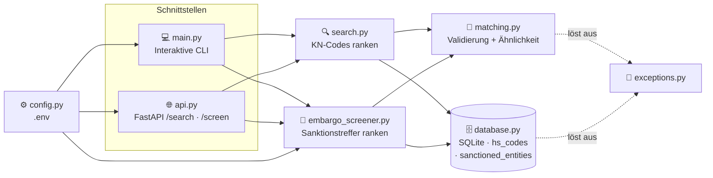
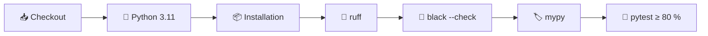

<div align="center">

# 🛃 CustomsIQ

### Compliance-Toolkit für Zoll- und Außenhandelsprozesse
**Waren unter der richtigen HS-/KN-Codenummer einreihen und Geschäftspartner gegen
Sanktionslisten prüfen.**

[](https://github.com/Mutersec/CustomsIQ/actions/workflows/ci.yml)


[🇬🇧 English](README.md) · [🇹🇷 Türkçe](README.tr.md) · **🇩🇪 Deutsch**

</div>

---

## 📑 Inhaltsverzeichnis

| | | |
|---|---|---|
| [🎯 Problemstellung](#-problemstellung) | [✨ Funktionen](#-funktionen) | [🏗️ Architektur](#️-architektur) |
| [🧠 Designentscheidungen](#-designentscheidungen) | [⚙️ Einrichtung](#️-einrichtung) | [🚀 Verwendung](#-verwendung) |
| [🌐 API-Referenz](#-api-referenz) | [🧪 Qualität und Tests](#-qualität-und-tests) | [📦 Beispieldaten](#-beispieldaten) |
| [🗺️ Roadmap](#️-roadmap) | [📁 Projektstruktur](#-projektstruktur) | [📄 Lizenz](#-lizenz) |

---

## 🎯 Problemstellung

Die Zuordnung der korrekten **KN-Codenummer** (der EU-*Kombinierten Nomenklatur*, die den
internationalen HS-Code auf 8 Stellen und im TARIC auf 10 Stellen erweitert) gehört zu den
langsamsten und fehleranfälligsten Schritten einer Zollanmeldung. Heute geschieht sie manuell —
anhand eines Zolltarifs mit Zehntausenden von Zeilen.

| Schwachstelle | Betriebswirtschaftliche Folge |
|---|---|
| 🔍 Manuelle Suche in einem riesigen Zolltarif | Langsame Anmeldungen; das Ergebnis hängt davon ab, wer gerade Schicht hat |
| ❌ Fehlerhafte Tarifierung | Falscher Zollsatz, Bußgelder, festgehaltene Sendungen |
| 🧠 Wissen steckt in den Köpfen Einzelner | Lange Einarbeitung, keine prüffähige Begründung für den gewählten Code |

**CustomsIQ automatisiert den ersten Durchgang:** Sie geben eine alltagssprachliche
Produktbeschreibung ein und erhalten eine nach Ähnlichkeitswert sortierte Vorauswahl an
Tarifnummern — ein Ausgangspunkt, den eine Fachkraft bestätigt, und keine Blackbox, die allein
entscheidet.

---

## ✨ Funktionen

| | Funktion | Beschreibung |
|---|---|---|
| 🔍 | **Unscharfe Suche** | Freitextbeschreibung → nach Ähnlichkeitswert sortierte KN-/TARIC-Codes |
| 🚫 | **Sanktionsprüfung** | Name → Treffer auf Verbotslisten, tolerant gegenüber Wortstellung und Teilnamen |
| 💻 | **Interaktive CLI** | Codes suchen oder `screen <Name>` am selben Prompt ausführen |
| 🌐 | **REST-API** | `GET /search` und `GET /screen` über FastAPI, mit erzeugter `/docs`-Oberfläche |
| 🗄️ | **Speicherung ohne Einrichtungsaufwand** | SQLite aus der Standardbibliothek, vorbefüllt mit 20 Codes + 18 fiktiven Einträgen |
| ⚙️ | **Konfiguration über Umgebung** | `pydantic-settings` liest `.env` — keine fest codierten Pfade oder Schwellenwerte |
| 🚨 | **Typisierte Fehler** | `InvalidQueryError`, `HSCodeNotFoundError` → saubere HTTP-`400`/`404`-Semantik |
| 🧪 | **Erzwungene Qualität** | ruff + black + mypy + 98 % Testabdeckung, bei jedem Push in der CI geprüft |

---

## 🏗️ Architektur

Zwei Funktionen — **KN-Code-Suche** und **Sanktionsprüfung** — setzen auf einer gemeinsamen
Matching-Schicht auf. CLI und HTTP-API sind dünne Adapter über `search()` und `screen_entity()`;
Scoring- und Validierungslogik existiert an genau einer Stelle und wird nie dupliziert.



### Zuständigkeiten der Module

| Modul | Zuständigkeit |
|---|---|
| `models.py` | `HSCode` und `SanctionedEntity` — die unveränderlichen Datensätze |
| `database.py` | SQLite-Schema, Verbindung, Beispieldaten, `fetch_all*()`, `get_by_code()` |
| `matching.py` | Eingabevalidierung + Ähnlichkeitsbewertung (**von beiden Funktionen genutzt**) |
| `search.py` | Rankt KN-Codes nach Beschreibungsähnlichkeit |
| `embargo_screener.py` | Rankt Sanktionslistentreffer nach Namensähnlichkeit |
| `exceptions.py` | `CustomsIQError` → `InvalidQueryError`, `HSCodeNotFoundError` |
| `config.py` | `pydantic-settings`; liest `CUSTOMSIQ_*`-Umgebungsvariablen und `.env` |
| `logging_config.py` | Gemeinsames Logging — schlichtes Format nach stdout, nirgends ein `print()` |
| `main.py` | Einstiegspunkt der interaktiven CLI (Suche + `screen <Name>`) |
| `api.py` | FastAPI-Anwendung: `GET /`, `GET /search`, `GET /screen` |

### Datenmodell

```sql
CREATE TABLE hs_codes (
    code        TEXT PRIMARY KEY,   -- z. B. "6109100000"
    description TEXT NOT NULL,      -- z. B. "Cotton T-shirts, knitted"
    category    TEXT NOT NULL       -- z. B. "Textile"
);

CREATE TABLE sanctioned_entities (
    name        TEXT PRIMARY KEY,   -- z. B. "Northwind Maritime Holdings Ltd"
    country     TEXT NOT NULL,      -- ISO 3166-1 alpha-2, z. B. "CY"
    list_source TEXT NOT NULL,      -- z. B. "EU Consolidated Financial Sanctions List"
    date_added  TEXT NOT NULL       -- ISO-8601-Datum, z. B. "2023-04-12"
);
```

---

## 🧠 Designentscheidungen

### Warum `difflib` statt `rapidfuzz` / `thefuzz`?

`difflib.SequenceMatcher` ist Teil von Python. Das bedeutet **keine zusätzliche Abhängigkeit**,
nichts zu pinnen oder sicherheitstechnisch zu prüfen, keine Installationshürde — und es genügt beim
derzeitigen Datenvolumen vollkommen.

| | `difflib` *(gewählt)* | `rapidfuzz` |
|---|---|---|
| **Abhängigkeit** | ✅ Standardbibliothek | ⚠️ Drittanbieter + C-Erweiterung |
| **Geschwindigkeit bei ~10² Zeilen** | ✅ Nicht wahrnehmbar | ✅ Nicht wahrnehmbar |
| **Geschwindigkeit bei ~10⁵ Zeilen** | ❌ Spürbar langsam | ✅ C-optimiert, deutlich schneller |
| **Toleranz gegenüber Wortstellung** | ❌ Nur positionsbasierter Abgleich | ✅ `token_sort`- / `token_set`-Scorer |
| **Durchsatz bei Massenverarbeitung** | ❌ Reines Python | ✅ `process.extract`, mehrkernfähig |

### 🔀 Wann der Wechsel ansteht

Ersetzen Sie `similarity()` in `matching.py` durch `rapidfuzz.fuzz.WRatio`, sobald **einer** dieser
Punkte zutrifft:

1. **📈 Datenvolumen** — der reale Zolltarif (Zehntausende Zeilen) macht den linearen Durchlauf messbar langsam.
2. **🔤 Wortstellung** — Abfragen wie *„Hose Baumwolle Herren“* sollen *„Men's cotton trousers“* treffen; positionsbasierter Abgleich leistet das schlecht.
3. **⚡ Durchsatz** — ein Stapellauf zur Neutarifierung benötigt Tausende Abfragen pro Sekunde.

> Der Austausch beschränkt sich auf **eine einzige Funktion**. Die Entscheidung bleibt damit
> günstig und lässt sich später treffen — sie ist keine Festlegung, die heute nötig wäre.

### Weitere bewusste Entscheidungen

| Entscheidung | Begründung | Ausbaupfad |
|---|---|---|
| **SQLite statt PostgreSQL** | Referenzdaten auf einem Knoten, überwiegend lesend; kein Betriebsaufwand | Verbindungsschicht austauschen, sobald mehrere Schreiber nötig werden |
| **Eine gemeinsame Verbindung** mit `check_same_thread=False` | Einfach und mit dem Threadpool von FastAPI verträglich | Verbindungspool, sobald parallele Schreibzugriffe auftreten |
| **Logging statt `print()`** | Derselbe Ausgabeweg für CLI und API; Level über die Konfiguration steuerbar | — |
| **Validierung in `matching.py`** | Suche, Prüfung, CLI und API erben sie; ein neuer Aufrufer kann sie nicht versehentlich umgehen | — |
| **Kein `EmbargoScreeningError`** | Die Eingabevalidierung der Prüfung ist identisch mit der der Suche, daher wird `InvalidQueryError` wiederverwendet statt eine Klasse zu duplizieren | Ergänzen, sobald die Prüfung einen wirklich eigenen Fehlerfall bekommt |

### 🚫 Namensabgleich ist kein Produktabgleich

Die Sanktionsprüfung nutzt aus Konsistenzgründen denselben `difflib`-Kern ohne zusätzliche
Abhängigkeit, doch Namen brauchten zwei weitere Signale neben dem einfachen Verhältnis. Gemessen
an der Demoliste:

| Abfrage ↔ gelisteter Name | einfach | tokensortiert | Token-Überschneidung |
|---|---|---|---|
| `John Smith` ↔ `Smith, John` | 0,50 ❌ | **1,00** ✅ | 1,00 |
| `Northwind Maritime` ↔ `Northwind Maritime Holdings Ltd` | 0,73 ❌ | 0,73 ❌ | **1,00** ✅ |
| `Smith` ↔ `John Smith` | 0,67 | 0,67 | 1,00 ⚠️ |

Abweichende Wortstellung erfordert **Tokensortierung**, unvollständige Firmennamen eine
**Token-Überschneidung**: Bei einem Schwellenwert von 0,75 verfehlen die beiden anderen Signale
Zeile 2 vollständig. Der Überschneidungsterm zählt nur, wenn der kürzere Name mindestens zwei Token
hat — sonst würde ein einzelner häufiger Nachname (Zeile 3) auf jeden Datensatz passen, der ihn
enthält. Die Prüfung nimmt das Maximum der anwendbaren Signale und ist bewusst großzügig: Ein
falsch Negativer lässt eine sanktionierte Partei durch, ein falsch Positiver kostet eine Fachkraft
einen Blick.

**Das — und nicht die Produktsuche — wird `rapidfuzz` zuerst rechtfertigen.** Die beiden Signale
sind handgeschriebene Varianten von `token_sort_ratio` und `token_set_ratio`; hinzu kommen
`partial_ratio` und ein erheblich schnellerer Durchlauf. Die echte konsolidierte
EU-Finanzsanktionsliste umfasst Tausende Einträge, die bei jeder Prüfung erneut durchlaufen werden,
und erfordert eine Behandlung von Aliassen und Transliterationen, für die `difflib` keine Antwort hat.

### 🇪🇺 EU-Ausrichtung

> Datenmodell und Terminologie orientieren sich an der Kombinierten Nomenklatur der EU und an
> EU-Rahmenwerken für Außenhandels-Compliance — passend zum Zielmarkt (Compliance-Rollen im
> EU-Außenhandel).

Konkret bedeutet das:

| Bereich | Maßgebliche Quelle |
|---|---|
| Tarifcodes und Nomenklatur | [EU-TARIC-Datenbank](https://ec.europa.eu/taxation_customs/dds2/taric) — KN-8-Codes, TARIC-10 mit EU-Unterpositionen |
| Sanktions- und Embargoprüfung | Konsolidierte EU-Finanzsanktionsliste |
| Präferenzzollsätze | EU-Handelsabkommen |

---

## ⚙️ Einrichtung

```bash
# 1. Repository klonen
git clone https://github.com/Mutersec/CustomsIQ.git
cd CustomsIQ

# 2. Virtuelle Umgebung
python3 -m venv .venv
source .venv/bin/activate          # Windows: .venv\Scripts\activate

# 3. Abhängigkeiten
pip install -r requirements.txt

# 4. (Optional) Konfiguration
cp .env.example .env
```

### Konfiguration

Alle Einstellungen stammen aus Umgebungsvariablen oder aus `.env`:

| Variable | Standard | Beschreibung |
|---|---|---|
| `CUSTOMSIQ_DATABASE_PATH` | `customsiq.db` | Pfad zur SQLite-Datei (`:memory:` für eine flüchtige Datenbank) |
| `CUSTOMSIQ_LOG_LEVEL` | `INFO` | Python-Loglevel (`DEBUG`, `INFO`, `WARNING`, …) |
| `CUSTOMSIQ_SCREENING_THRESHOLD` | `0.75` | Mindest-Namensähnlichkeit (0–1) für einen Prüftreffer |

---

## 🚀 Verwendung

### 💻 Interaktive CLI

```bash
python -m src.customsiq.main
```

```text
seeded 20 rows into hs_codes
seeded 18 rows into sanctioned_entities
CustomsIQ (type 'quit' to exit)
Enter a product description to search CN codes,
or 'screen <name>' to run a sanctions check.

> cotton t-shirt
1. 6109100000  (74%)  Cotton T-shirts, knitted        [Textile]
2. 6203420000  (57%)  Men's cotton trousers           [Textile]
3. 6204620000  (54%)  Women's cotton trousers         [Textile]
4. 6110200000  (42%)  Cotton pullovers and sweaters   [Textile]
5. 8528721000  (35%)  Color television receivers      [Electronics]

> screen Northwind Maritime
1 potential sanctions match(es) for 'Northwind Maritime':
1. Northwind Maritime Holdings Ltd  (100%)  [CY]  EU Consolidated Financial Sanctions List  listed 2023-04-12

> screen Quokka Beachwear
No sanctions match for 'Quokka Beachwear'.
```

### 🌐 REST-API

```bash
uvicorn src.customsiq.api:app --reload
```

Öffnen Sie anschließend **http://localhost:8000/docs** für die interaktive Swagger-Oberfläche.

```bash
curl "http://localhost:8000/search?q=cotton+t-shirt&limit=2"
```

```json
[
  {
    "code": "6109100000",
    "description": "Cotton T-shirts, knitted",
    "category": "Textile",
    "score": 0.7368421052631579
  },
  {
    "code": "6203420000",
    "description": "Men's cotton trousers",
    "category": "Textile",
    "score": 0.5714285714285714
  }
]
```

### 🐍 Als Bibliothek

```python
from src.customsiq.database import get_connection, seed
from src.customsiq.search import search

conn = get_connection("customsiq.db")
seed(conn)

for result in search(conn, "lithium battery", limit=3):
    print(f"{result.hs_code.code}  {result.score:.0%}  {result.hs_code.description}")
```

---

## 🌐 API-Referenz

| Methode | Endpunkt | Beschreibung |
|---|---|---|
| `GET` | `/` | Dienstinformationen — `{"service": "CustomsIQ API", "docs": "/docs", "status": "running"}` |
| `GET` | `/search` | Sortierte KN-Code-Treffer zu einer Produktbeschreibung |
| `GET` | `/screen` | Sanktionslistentreffer zu einem Personen- oder Firmennamen |
| `GET` | `/docs` | Interaktive Swagger-Oberfläche (automatisch erzeugt) |

**Parameter von `GET /search`**

| Parameter | Typ | Standard | Einschränkungen | Beschreibung |
|---|---|---|---|---|
| `q` | `str` | *erforderlich* | 1–500 Zeichen, nicht leer | Freitext-Produktbeschreibung |
| `limit` | `int` | `5` | 1–50 | Maximale Anzahl an Treffern |

**Parameter von `GET /screen`**

| Parameter | Typ | Standard | Einschränkungen | Beschreibung |
|---|---|---|---|---|
| `name` | `str` | *erforderlich* | 1–500 Zeichen, nicht leer | Zu prüfender Personen- oder Firmenname |

Die Prüfung kennt kein `limit`: Jeder Treffer oberhalb des Schwellenwerts wird zurückgegeben — eine
still gekürzte Trefferliste wäre ein Compliance-Verstoß und nicht bloß ein schlechteres Ranking.

```bash
curl "http://localhost:8000/screen?name=Northwind+Maritime"
```

```json
[
  {
    "name": "Northwind Maritime Holdings Ltd",
    "country": "CY",
    "list_source": "EU Consolidated Financial Sanctions List",
    "date_added": "2023-04-12",
    "score": 1.0
  }
]
```

**Statuscodes**

| Code | Bedeutung |
|---|---|
| `200` | Erfolg — Liste der Treffer (kann leer sein) |
| `400` | `InvalidQueryError` — leere Abfrage oder länger als 500 Zeichen |
| `422` | Fehlender/ungültiger Parametertyp (FastAPI-Validierung) |

---

## 🧪 Qualität und Tests

Bei jedem Push und Pull Request läuft die vollständige Qualitätsprüfung über
[GitHub Actions](.github/workflows/ci.yml):



```bash
ruff check .                                                  # Linting
black .                                                       # Formatierung
mypy src                                                      # Typprüfung
pytest --cov --cov-report=term-missing --cov-fail-under=80    # Tests + Abdeckungsschwelle
```

### Aktuelle Testabdeckung

| Modul | Abdeckung |
|---|---|
| `config.py` · `database.py` · `embargo_screener.py` · `matching.py` | 🟢 100 % |
| `exceptions.py` · `logging_config.py` · `models.py` · `search.py` | 🟢 100 % |
| `api.py` | 🟢 96 % |
| `main.py` | 🟢 93 % |
| **Gesamt** | **🟢 98 %** (37 Tests, Schwelle bei 80 %) |

### Getestete Grenzfälle

| Fall | Erwartetes Verhalten |
|---|---|
| Leere Abfrage bzw. nur Leerzeichen oder leerer Name | `InvalidQueryError` → HTTP `400` |
| Abfrage länger als 500 Zeichen | `InvalidQueryError` → HTTP `400` |
| Eingabe in SQL-Injection-Form (`'; DROP TABLE hs_codes; --`) | Durch parametrisierte Abfragen sicher behandelt; Tabelle bleibt intakt |
| Emoji und Nicht-ASCII-Eingaben (`📱 Handy-Ladegerät`, `Ünal Çelik A.Ş.`) | Normal bewertet, kein Absturz |
| Umgekehrte Namensreihenfolge (`Aleksandr Voronin-Teske`) | Trifft den nachnamenzuerst gelisteten Eintrag |
| Unvollständiger Firmenname (`Northwind Maritime`) | Trifft den vollständig gelisteten Namen |
| Name ohne Entsprechung auf der Liste | Leeres Ergebnis, kein Fehler |
| Exakte Suche nach unbekanntem Code | `HSCodeNotFoundError` |
| Erneutes Befüllen einer gefüllten Datenbank | Idempotent — keine doppelten Datensätze in beiden Tabellen |

---

## 📦 Beispieldaten

Die Datenbank wird mit **20 repräsentativen KN-/TARIC-Codes aus 8 Kategorien** vorbefüllt, formuliert
im Stil der EU-Kombinierten Nomenklatur:

| Kategorie | Codes |
|---|---|
| 📱 Elektronik | 5 |
| 👕 Textilien | 5 |
| 🍫 Lebensmittel | 5 |
| 💊 Pharmazeutika · 🚗 Kfz · 🪑 Möbel · 🧴 Kunststoffe · 🔩 Metalle | je 1 |

<details>
<summary><b>Alle 20 hinterlegten Codes anzeigen</b></summary>

| KN-/TARIC-Code | Beschreibung | Kategorie |
|---|---|---|
| `8517120000` | Mobiltelefone und Smartphones | Elektronik |
| `8471300000` | Tragbare automatische Datenverarbeitungsmaschinen (Notebooks) | Elektronik |
| `8528721000` | Farbfernsehempfangsgeräte | Elektronik |
| `8544421000` | USB-Kabel und Datenkabel | Elektronik |
| `8507600000` | Lithium-Ionen-Akkumulatoren | Elektronik |
| `6109100000` | T-Shirts aus Baumwolle, gewirkt | Textilien |
| `6203420000` | Herrenhosen aus Baumwolle | Textilien |
| `6204620000` | Damenhosen aus Baumwolle | Textilien |
| `6110200000` | Pullover und Sweatshirts aus Baumwolle | Textilien |
| `6402990000` | Schuhe mit Laufsohlen aus Kautschuk oder Kunststoff | Textilien |
| `0901210000` | Gerösteter Kaffee, nicht entkoffeiniert | Lebensmittel |
| `1806320000` | Schokoladentafeln, ohne Füllung | Lebensmittel |
| `2009110000` | Gefrorener Orangensaft | Lebensmittel |
| `0406100000` | Frischkäse | Lebensmittel |
| `1905310000` | Süße Kekse | Lebensmittel |
| `3004900000` | Arzneiwaren zu therapeutischen Zwecken | Pharmazeutika |
| `4011100000` | Neue Luftreifen für Personenkraftwagen | Kfz |
| `9403300000` | Büromöbel aus Holz | Möbel |
| `3926909700` | Haushaltsartikel aus Kunststoff | Kunststoffe |
| `7326909800` | Verschiedene Waren aus Eisen oder Stahl | Metalle |

</details>

> ⚠️ Hierbei handelt es sich um **Demodaten** für Entwicklung und Tests. Für den Produktivbetrieb
> wird die offizielle Nomenklatur aus der
> [EU-TARIC-Datenbank](https://ec.europa.eu/taxation_customs/dds2/taric) benötigt.

### Sanktionsliste

Die Tabelle `sanctioned_entities` wird mit **18 Einträgen** im Stil der konsolidierten
EU-Finanzsanktionsliste vorbefüllt: erfundene Handels-, Schifffahrts- und Ingenieurunternehmen sowie
einige synthetische Personennamen, nachnamenzuerst gespeichert, wie es echte Listen veröffentlichen.

| Feld | Beispiel |
|---|---|
| `name` | `Northwind Maritime Holdings Ltd` · `Voronin-Teske, Aleksandr` |
| `country` | `CY`, `AE`, `DE`, `RS`, `MT`, `NL`, … |
| `list_source` | `EU Consolidated Financial Sanctions List` · `EU Dual-Use Export Control Watchlist` |
| `date_added` | `2023-04-12` |

> 🚨 **Jeder Name in dieser Liste ist fiktiv.** Keiner entspricht einer real sanktionierten Person
> oder Organisation, und die Liste darf niemals für eine echte Prüfung verwendet werden. Der
> Produktivbetrieb erfordert die offizielle konsolidierte EU-Finanzsanktionsliste.

---

## 🗺️ Roadmap

KN-Code-Suche und Sanktionsprüfung sind beide einsatzbereit. Zwei Compliance-Module bleiben als
Gerüst angelegt — bis sie echte Logik enthalten, bleiben sie von der Abdeckungsschwelle ausgenommen:

| Modul | Status | Funktionsumfang |
|---|---|---|
| `search.py` + `api.py` | ✅ **Ausgeliefert** | Unscharfe KN-Code-Suche über CLI und REST |
| `embargo_screener.py` | ✅ **Ausgeliefert** | Namensprüfung gegen Verbotslisten über CLI und REST |
| `cn_classifier.py` | 🚧 Gerüst | Regel- und konfidenzbasierte Tarifierung gegen den EU-TARIC-Datenbestand |
| `tariff_calculator.py` | 🚧 Gerüst | Zollberechnung, Ursprungsregeln, Präferenzzollsätze aus EU-Handelsabkommen |

Geplante Erweiterungen der Prüfung: länderbezogene Embargokontrollen, Waren-/Bestimmungsbeschränkungen
sowie Alias- und Transliterationsbehandlung für Entitätsnamen.

---

## 📁 Projektstruktur

```text
CustomsIQ/
├── .github/workflows/ci.yml     # ruff → black → mypy → pytest
├── src/
│   ├── customsiq/
│   │   ├── models.py            # HSCode- + SanctionedEntity-Datensätze
│   │   ├── database.py          # SQLite-Schicht + Beispieldaten (beide Tabellen)
│   │   ├── matching.py          # gemeinsame Validierung + Ähnlichkeitsbewertung
│   │   ├── search.py            # KN-Code-Ranking
│   │   ├── embargo_screener.py  # Namensprüfung gegen Sanktionslisten
│   │   ├── exceptions.py        # typisierte Fehlerhierarchie
│   │   ├── config.py            # pydantic-settings / .env
│   │   ├── logging_config.py    # gemeinsames Logging-Setup
│   │   ├── main.py              # CLI-Einstiegspunkt
│   │   ├── api.py               # FastAPI-Anwendung
│   │   ├── cn_classifier.py     # 🚧 Gerüst
│   │   └── tariff_calculator.py # 🚧 Gerüst
│   └── utils/validators.py      # Validierung von KN-/TARIC-Format und Ländercode
├── tests/                       # 37 Tests — Unit, API, CLI, Prüfung, Grenzfälle
├── pyproject.toml               # ruff · black · mypy · pytest · coverage
├── requirements.txt
└── .env.example
```

---

## 📄 Lizenz

Veröffentlicht unter der **MIT-Lizenz**.

<div align="center">

[🇬🇧 English](README.md) · [🇹🇷 Türkçe](README.tr.md) · **🇩🇪 Deutsch**

</div>
