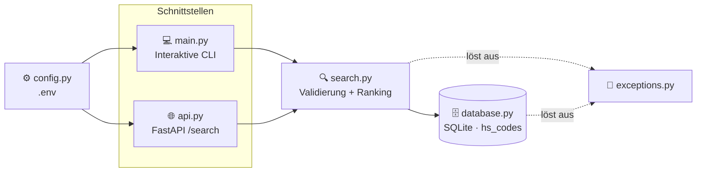

<div align="center">

# 🛃 CustomsIQ

### Compliance-Toolkit für Zoll- und Außenhandelsprozesse
**Aus einer alltagssprachlichen Produktbeschreibung die richtige HS-/KN-Codenummer ermitteln.**

[](https://github.com/Mutersec/CustomsIQ/actions/workflows/ci.yml)


[🇬🇧 English](README.md) · [🇹🇷 Türkçe](README.tr.md) · **🇩🇪 Deutsch**

</div>

---

## 📑 Inhaltsverzeichnis

| | | |
|---|---|---|
| [🎯 Problemstellung](#-problemstellung) | [✨ Funktionen](#-funktionen) | [🏗️ Architektur](#️-architektur) |
| [🧠 Designentscheidungen](#-designentscheidungen) | [⚙️ Einrichtung](#️-einrichtung) | [🚀 Verwendung](#-verwendung) |
| [🌐 API-Referenz](#-api-referenz) | [🧪 Qualität und Tests](#-qualität-und-tests) | [📦 Beispieldaten](#-beispieldaten) |
| [🗺️ Roadmap](#️-roadmap) | [📁 Projektstruktur](#-projektstruktur) | [📄 Lizenz](#-lizenz) |

---

## 🎯 Problemstellung

Die Zuordnung der korrekten **KN-Codenummer** (der EU-*Kombinierten Nomenklatur*, die den
internationalen HS-Code auf 8 Stellen und im TARIC auf 10 Stellen erweitert) gehört zu den
langsamsten und fehleranfälligsten Schritten einer Zollanmeldung. Heute geschieht sie manuell —
anhand eines Zolltarifs mit Zehntausenden von Zeilen.

| Schwachstelle | Betriebswirtschaftliche Folge |
|---|---|
| 🔍 Manuelle Suche in einem riesigen Zolltarif | Langsame Anmeldungen; das Ergebnis hängt davon ab, wer gerade Schicht hat |
| ❌ Fehlerhafte Tarifierung | Falscher Zollsatz, Bußgelder, festgehaltene Sendungen |
| 🧠 Wissen steckt in den Köpfen Einzelner | Lange Einarbeitung, keine prüffähige Begründung für den gewählten Code |

**CustomsIQ automatisiert den ersten Durchgang:** Sie geben eine alltagssprachliche
Produktbeschreibung ein und erhalten eine nach Ähnlichkeitswert sortierte Vorauswahl an
Tarifnummern — ein Ausgangspunkt, den eine Fachkraft bestätigt, und keine Blackbox, die allein
entscheidet.

---

## ✨ Funktionen

| | Funktion | Beschreibung |
|---|---|---|
| 🔍 | **Unscharfe Suche** | Freitextbeschreibung → nach Ähnlichkeitswert sortierte KN-/TARIC-Codes |
| 💻 | **Interaktive CLI** | Beschreibung eingeben, sofort sortierte Treffer im Terminal erhalten |
| 🌐 | **REST-API** | `GET /search` über FastAPI, mit automatisch erzeugter `/docs`-Oberfläche |
| 🗄️ | **Speicherung ohne Einrichtungsaufwand** | SQLite aus der Standardbibliothek, vorbefüllt mit 20 Demo-Codes |
| ⚙️ | **Konfiguration über Umgebung** | `pydantic-settings` liest `.env` — keine fest codierten Pfade |
| 🚨 | **Typisierte Fehler** | `InvalidQueryError`, `HSCodeNotFoundError` → saubere HTTP-`400`/`404`-Semantik |
| 🧪 | **Erzwungene Qualität** | ruff + black + mypy + 97 % Testabdeckung, bei jedem Push in der CI geprüft |

---

## 🏗️ Architektur

CLI und HTTP-API sind **dünne Adapter über einer gemeinsamen `search()`-Funktion** — die
Ranking-Logik existiert an genau einer Stelle und wird nie dupliziert.



### Zuständigkeiten der Module

| Modul | Zuständigkeit |
|---|---|
| `models.py` | `HSCode` — der unveränderliche Datensatz `(Code, Beschreibung, Kategorie)` |
| `database.py` | SQLite-Schema, Verbindung, Beispieldaten, `fetch_all()`, `get_by_code()` |
| `search.py` | Abfragevalidierung + `difflib`-Ähnlichkeitsranking (**die einzige Quelle der Wahrheit**) |
| `exceptions.py` | `CustomsIQError` → `InvalidQueryError`, `HSCodeNotFoundError` |
| `config.py` | `pydantic-settings`; liest `CUSTOMSIQ_*`-Umgebungsvariablen und `.env` |
| `logging_config.py` | Gemeinsames Logging — schlichtes Format nach stdout, nirgends ein `print()` |
| `main.py` | Einstiegspunkt der interaktiven CLI |
| `api.py` | FastAPI-Anwendung: `GET /` und `GET /search` |

### Datenmodell

```sql
CREATE TABLE hs_codes (
    code        TEXT PRIMARY KEY,   -- z. B. "6109100000"
    description TEXT NOT NULL,      -- z. B. "Cotton T-shirts, knitted"
    category    TEXT NOT NULL       -- z. B. "Textile"
);
```

---

## 🧠 Designentscheidungen

### Warum `difflib` statt `rapidfuzz` / `thefuzz`?

`difflib.SequenceMatcher` ist Teil von Python. Das bedeutet **keine zusätzliche Abhängigkeit**,
nichts zu pinnen oder sicherheitstechnisch zu prüfen, keine Installationshürde — und es genügt beim
derzeitigen Datenvolumen vollkommen.

| | `difflib` *(gewählt)* | `rapidfuzz` |
|---|---|---|
| **Abhängigkeit** | ✅ Standardbibliothek | ⚠️ Drittanbieter + C-Erweiterung |
| **Geschwindigkeit bei ~10² Zeilen** | ✅ Nicht wahrnehmbar | ✅ Nicht wahrnehmbar |
| **Geschwindigkeit bei ~10⁵ Zeilen** | ❌ Spürbar langsam | ✅ C-optimiert, deutlich schneller |
| **Toleranz gegenüber Wortstellung** | ❌ Nur positionsbasierter Abgleich | ✅ `token_sort`- / `token_set`-Scorer |
| **Durchsatz bei Massenverarbeitung** | ❌ Reines Python | ✅ `process.extract`, mehrkernfähig |

### 🔀 Wann der Wechsel ansteht

Ersetzen Sie `_similarity()` in `search.py` durch `rapidfuzz.fuzz.WRatio`, sobald **einer** dieser
Punkte zutrifft:

1. **📈 Datenvolumen** — der reale Zolltarif (Zehntausende Zeilen) macht den linearen Durchlauf messbar langsam.
2. **🔤 Wortstellung** — Abfragen wie *„Hose Baumwolle Herren“* sollen *„Men's cotton trousers“* treffen; positionsbasierter Abgleich leistet das schlecht.
3. **⚡ Durchsatz** — ein Stapellauf zur Neutarifierung benötigt Tausende Abfragen pro Sekunde.

> Der Austausch beschränkt sich auf **eine einzige Funktion**. Die Entscheidung bleibt damit
> günstig und lässt sich später treffen — sie ist keine Festlegung, die heute nötig wäre.

### Weitere bewusste Entscheidungen

| Entscheidung | Begründung | Ausbaupfad |
|---|---|---|
| **SQLite statt PostgreSQL** | Referenzdaten auf einem Knoten, überwiegend lesend; kein Betriebsaufwand | Verbindungsschicht austauschen, sobald mehrere Schreiber nötig werden |
| **Eine gemeinsame Verbindung** mit `check_same_thread=False` | Einfach und mit dem Threadpool von FastAPI verträglich | Verbindungspool, sobald parallele Schreibzugriffe auftreten |
| **Logging statt `print()`** | Derselbe Ausgabeweg für CLI und API; Level über die Konfiguration steuerbar | — |
| **Validierung innerhalb von `search()`** | CLI und API erben sie; ein neuer Aufrufer kann sie nicht versehentlich umgehen | — |

### 🇪🇺 EU-Ausrichtung

> Datenmodell und Terminologie orientieren sich an der Kombinierten Nomenklatur der EU und an
> EU-Rahmenwerken für Außenhandels-Compliance — passend zum Zielmarkt (Compliance-Rollen im
> EU-Außenhandel).

Konkret bedeutet das:

| Bereich | Maßgebliche Quelle |
|---|---|
| Tarifcodes und Nomenklatur | [EU-TARIC-Datenbank](https://ec.europa.eu/taxation_customs/dds2/taric) — KN-8-Codes, TARIC-10 mit EU-Unterpositionen |
| Sanktions- und Embargoprüfung | Konsolidierte EU-Finanzsanktionsliste |
| Präferenzzollsätze | EU-Handelsabkommen |

---

## ⚙️ Einrichtung

```bash
# 1. Repository klonen
git clone https://github.com/Mutersec/CustomsIQ.git
cd CustomsIQ

# 2. Virtuelle Umgebung
python3 -m venv .venv
source .venv/bin/activate          # Windows: .venv\Scripts\activate

# 3. Abhängigkeiten
pip install -r requirements.txt

# 4. (Optional) Konfiguration
cp .env.example .env
```

### Konfiguration

Alle Einstellungen stammen aus Umgebungsvariablen oder aus `.env`:

| Variable | Standard | Beschreibung |
|---|---|---|
| `CUSTOMSIQ_DATABASE_PATH` | `customsiq.db` | Pfad zur SQLite-Datei (`:memory:` für eine flüchtige Datenbank) |
| `CUSTOMSIQ_LOG_LEVEL` | `INFO` | Python-Loglevel (`DEBUG`, `INFO`, `WARNING`, …) |

---

## 🚀 Verwendung

### 💻 Interaktive CLI

```bash
python -m src.customsiq.main
```

```text
seeded 20 HS code records
CustomsIQ - HS Code Search (type 'quit' to exit)

Product description: cotton t-shirt
1. 6109100000  (74%)  Cotton T-shirts, knitted        [Textile]
2. 6203420000  (57%)  Men's cotton trousers           [Textile]
3. 6204620000  (54%)  Women's cotton trousers         [Textile]
4. 6110200000  (42%)  Cotton pullovers and sweaters   [Textile]
5. 8528721000  (35%)  Color television receivers      [Electronics]
```

### 🌐 REST-API

```bash
uvicorn src.customsiq.api:app --reload
```

Öffnen Sie anschließend **http://localhost:8000/docs** für die interaktive Swagger-Oberfläche.

```bash
curl "http://localhost:8000/search?q=cotton+t-shirt&limit=2"
```

```json
[
  {
    "code": "6109100000",
    "description": "Cotton T-shirts, knitted",
    "category": "Textile",
    "score": 0.7368421052631579
  },
  {
    "code": "6203420000",
    "description": "Men's cotton trousers",
    "category": "Textile",
    "score": 0.5714285714285714
  }
]
```

### 🐍 Als Bibliothek

```python
from src.customsiq.database import get_connection, seed
from src.customsiq.search import search

conn = get_connection("customsiq.db")
seed(conn)

for result in search(conn, "lithium battery", limit=3):
    print(f"{result.hs_code.code}  {result.score:.0%}  {result.hs_code.description}")
```

---

## 🌐 API-Referenz

| Methode | Endpunkt | Beschreibung |
|---|---|---|
| `GET` | `/` | Dienstinformationen — `{"service": "CustomsIQ API", "docs": "/docs", "status": "running"}` |
| `GET` | `/search` | Sortierte KN-Code-Treffer zu einer Produktbeschreibung |
| `GET` | `/docs` | Interaktive Swagger-Oberfläche (automatisch erzeugt) |

**Parameter von `GET /search`**

| Parameter | Typ | Standard | Einschränkungen | Beschreibung |
|---|---|---|---|---|
| `q` | `str` | *erforderlich* | 1–500 Zeichen, nicht leer | Freitext-Produktbeschreibung |
| `limit` | `int` | `5` | 1–50 | Maximale Anzahl an Treffern |

**Statuscodes**

| Code | Bedeutung |
|---|---|
| `200` | Erfolg — Liste der Treffer (kann leer sein) |
| `400` | `InvalidQueryError` — leere Abfrage oder länger als 500 Zeichen |
| `422` | Fehlender/ungültiger Parametertyp (FastAPI-Validierung) |

---

## 🧪 Qualität und Tests

Bei jedem Push und Pull Request läuft die vollständige Qualitätsprüfung über
[GitHub Actions](.github/workflows/ci.yml):


```bash
ruff check .                                                  # Linting
black .                                                       # Formatierung
mypy src                                                      # Typprüfung
pytest --cov --cov-report=term-missing --cov-fail-under=80    # Tests + Abdeckungsschwelle
```

### Aktuelle Testabdeckung

| Modul | Abdeckung |
|---|---|
| `api.py` · `config.py` · `database.py` | 🟢 100 % |
| `exceptions.py` · `logging_config.py` · `models.py` · `search.py` | 🟢 100 % |
| `main.py` | 🟢 90 % |
| **Gesamt** | **🟢 97,5 %** (20 Tests, Schwelle bei 80 %) |

### Getestete Grenzfälle

| Fall | Erwartetes Verhalten |
|---|---|
| Leere Abfrage bzw. nur Leerzeichen | `InvalidQueryError` → HTTP `400` |
| Abfrage länger als 500 Zeichen | `InvalidQueryError` → HTTP `400` |
| Eingabe in SQL-Injection-Form (`'; DROP TABLE hs_codes; --`) | Durch parametrisierte Abfragen sicher behandelt; Tabelle bleibt intakt |
| Emoji und Nicht-ASCII-Eingaben (`📱 telefon şarj aleti`) | Normal bewertet, kein Absturz |
| Exakte Suche nach unbekanntem Code | `HSCodeNotFoundError` |
| Erneutes Befüllen einer gefüllten Datenbank | Idempotent — keine doppelten Datensätze |

---

## 📦 Beispieldaten

Die Datenbank wird mit **20 repräsentativen KN-/TARIC-Codes aus 8 Kategorien** vorbefüllt, formuliert
im Stil der EU-Kombinierten Nomenklatur:

| Kategorie | Codes |
|---|---|
| 📱 Elektronik | 5 |
| 👕 Textilien | 5 |
| 🍫 Lebensmittel | 5 |
| 💊 Pharmazeutika · 🚗 Kfz · 🪑 Möbel · 🧴 Kunststoffe · 🔩 Metalle | je 1 |

<details>
<summary><b>Alle 20 hinterlegten Codes anzeigen</b></summary>

| KN-/TARIC-Code | Beschreibung | Kategorie |
|---|---|---|
| `8517120000` | Mobiltelefone und Smartphones | Elektronik |
| `8471300000` | Tragbare automatische Datenverarbeitungsmaschinen (Notebooks) | Elektronik |
| `8528721000` | Farbfernsehempfangsgeräte | Elektronik |
| `8544421000` | USB-Kabel und Datenkabel | Elektronik |
| `8507600000` | Lithium-Ionen-Akkumulatoren | Elektronik |
| `6109100000` | T-Shirts aus Baumwolle, gewirkt | Textilien |
| `6203420000` | Herrenhosen aus Baumwolle | Textilien |
| `6204620000` | Damenhosen aus Baumwolle | Textilien |
| `6110200000` | Pullover und Sweatshirts aus Baumwolle | Textilien |
| `6402990000` | Schuhe mit Laufsohlen aus Kautschuk oder Kunststoff | Textilien |
| `0901210000` | Gerösteter Kaffee, nicht entkoffeiniert | Lebensmittel |
| `1806320000` | Schokoladentafeln, ohne Füllung | Lebensmittel |
| `2009110000` | Gefrorener Orangensaft | Lebensmittel |
| `0406100000` | Frischkäse | Lebensmittel |
| `1905310000` | Süße Kekse | Lebensmittel |
| `3004900000` | Arzneiwaren zu therapeutischen Zwecken | Pharmazeutika |
| `4011100000` | Neue Luftreifen für Personenkraftwagen | Kfz |
| `9403300000` | Büromöbel aus Holz | Möbel |
| `3926909700` | Haushaltsartikel aus Kunststoff | Kunststoffe |
| `7326909800` | Verschiedene Waren aus Eisen oder Stahl | Metalle |

</details>

> ⚠️ Hierbei handelt es sich um **Demodaten** für Entwicklung und Tests. Für den Produktivbetrieb
> wird die offizielle Nomenklatur aus der
> [EU-TARIC-Datenbank](https://ec.europa.eu/taxation_customs/dds2/taric) benötigt.

---

## 🗺️ Roadmap

Das KN-Code-Modul ist einsatzbereit. Drei weitere Compliance-Module sind als Gerüst angelegt und
warten auf die Implementierung — bis sie echte Logik enthalten, bleiben sie von der
Abdeckungsschwelle ausgenommen:

| Modul | Status | Geplanter Funktionsumfang |
|---|---|---|
| `search.py` + `api.py` | ✅ **Ausgeliefert** | Unscharfe KN-Code-Suche über CLI und REST |
| `cn_classifier.py` | 🚧 Gerüst | Regel- und konfidenzbasierte Tarifierung gegen den EU-TARIC-Datenbestand |
| `tariff_calculator.py` | 🚧 Gerüst | Zollberechnung, Ursprungsregeln, Präferenzzollsätze aus EU-Handelsabkommen |
| `embargo_screener.py` | 🚧 Gerüst | Prüfung gegen die konsolidierte EU-Finanzsanktionsliste |

---

## 📁 Projektstruktur

```text
CustomsIQ/
├── .github/workflows/ci.yml     # ruff → black → mypy → pytest
├── src/
│   ├── customsiq/
│   │   ├── models.py            # HSCode-Datensatz
│   │   ├── database.py          # SQLite-Schicht + Beispieldaten
│   │   ├── search.py            # Validierung + Ähnlichkeitsranking
│   │   ├── exceptions.py        # typisierte Fehlerhierarchie
│   │   ├── config.py            # pydantic-settings / .env
│   │   ├── logging_config.py    # gemeinsames Logging-Setup
│   │   ├── main.py              # CLI-Einstiegspunkt
│   │   ├── api.py               # FastAPI-Anwendung
│   │   ├── cn_classifier.py     # 🚧 Gerüst
│   │   ├── tariff_calculator.py # 🚧 Gerüst
│   │   └── embargo_screener.py  # 🚧 Gerüst
│   └── utils/validators.py      # Validierung von KN-/TARIC-Format und Ländercode
├── tests/                       # 20 Tests — Unit, API, CLI, Grenzfälle
├── pyproject.toml               # ruff · black · mypy · pytest · coverage
├── requirements.txt
└── .env.example
```

---

## 📄 Lizenz

Veröffentlicht unter der **MIT-Lizenz**.

<div align="center">

[🇬🇧 English](README.md) · [🇹🇷 Türkçe](README.tr.md) · **🇩🇪 Deutsch**

</div>
