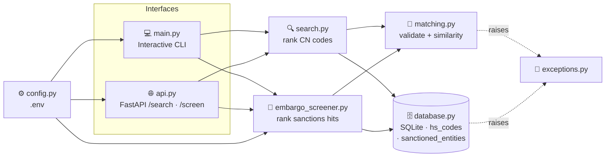
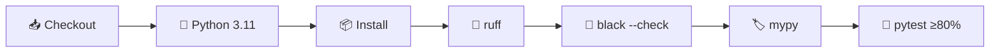

<div align="center">

# 🛃 CustomsIQ

### Trade compliance toolkit for customs & foreign trade operations
**Classify goods under the right HS / CN tariff code, and screen counterparties against
sanctions lists.**

[](https://github.com/Mutersec/CustomsIQ/actions/workflows/ci.yml)


**🇬🇧 English** · [🇹🇷 Türkçe](README.tr.md) · [🇩🇪 Deutsch](README.de.md)

</div>

---

## 📑 Table of contents

| | | |
|---|---|---|
| [🎯 Problem](#-problem) | [✨ Features](#-features) | [🏗️ Architecture](#️-architecture) |
| [🧠 Design decisions](#-design-decisions) | [⚙️ Setup](#️-setup) | [🚀 Usage](#-usage) |
| [🌐 API reference](#-api-reference) | [🧪 Quality & testing](#-quality--testing) | [📦 Sample data](#-sample-data) |
| [🗺️ Roadmap](#️-roadmap) | [📁 Project layout](#-project-layout) | [📄 License](#-license) |

---

## 🎯 Problem

Assigning the correct **CN code** (the EU *Combined Nomenclature*, which extends the international
HS code to 8 digits, and to 10 in TARIC) is one of the slowest and most error-prone steps in a
customs declaration. Today it is done by hand, against a tariff schedule with tens of thousands of
lines.

| Pain point | Business consequence |
|---|---|
| 🔍 Manual lookup across a huge tariff schedule | Slow declarations; results depend on which operator is on shift |
| ❌ Misclassification | Wrong duty rate, penalties, held shipments |
| 🧠 Knowledge locked in people's heads | Slow onboarding, no auditable rationale for a chosen code |

**CustomsIQ automates the first pass:** give it a plain-language product description, get back a
ranked shortlist of tariff codes with a similarity score — a starting point a human expert confirms,
not a black box that decides alone.

---

## ✨ Features

| | Feature | Description |
|---|---|---|
| 🔍 | **Fuzzy search** | Free-text description → CN/TARIC codes ranked by similarity score |
| 🚫 | **Sanctions screening** | Name → denied-party hits, tolerant of word order and partial names |
| 💻 | **Interactive CLI** | Search codes or run `screen <name>` from the same prompt |
| 🌐 | **REST API** | `GET /search` and `GET /screen` on FastAPI, with auto-generated `/docs` |
| 🗄️ | **Zero-setup storage** | SQLite via the standard library, seeded with 20 codes + 18 mock entities |
| ⚙️ | **Env-based config** | `pydantic-settings` reads `.env` — no hardcoded paths or thresholds |
| 🚨 | **Typed errors** | `InvalidQueryError`, `HSCodeNotFoundError` → clean HTTP 400 / 404 semantics |
| 🧪 | **Enforced quality** | ruff + black + mypy + 98% coverage, gated in CI on every push |

---

## 🏗️ Architecture

Two features — **CN code search** and **sanctions screening** — sit on one shared matching layer.
The CLI and the HTTP API are thin adapters over `search()` and `screen_entity()`; scoring and
validation logic exists in exactly one place and is never duplicated.



### Module responsibilities

| Module | Responsibility |
|---|---|
| `models.py` | `HSCode` and `SanctionedEntity` — the immutable records |
| `database.py` | SQLite schema, connection, seed data, `fetch_all*()`, `get_by_code()` |
| `matching.py` | Input validation + similarity scoring (**shared by both features**) |
| `search.py` | Ranks CN codes by description similarity |
| `embargo_screener.py` | Ranks sanctions-list hits by name similarity |
| `exceptions.py` | `CustomsIQError` → `InvalidQueryError`, `HSCodeNotFoundError` |
| `config.py` | `pydantic-settings`; reads `CUSTOMSIQ_*` env vars and `.env` |
| `logging_config.py` | Shared logging setup — plain formatter to stdout, no `print()` anywhere |
| `main.py` | Interactive CLI entry point (search + `screen <name>`) |
| `api.py` | FastAPI app: `GET /`, `GET /search`, `GET /screen` |

### Data model

```sql
CREATE TABLE hs_codes (
    code        TEXT PRIMARY KEY,   -- e.g. "6109100000"
    description TEXT NOT NULL,      -- e.g. "Cotton T-shirts, knitted"
    category    TEXT NOT NULL       -- e.g. "Textile"
);

CREATE TABLE sanctioned_entities (
    name        TEXT PRIMARY KEY,   -- e.g. "Northwind Maritime Holdings Ltd"
    country     TEXT NOT NULL,      -- ISO 3166-1 alpha-2, e.g. "CY"
    list_source TEXT NOT NULL,      -- e.g. "EU Consolidated Financial Sanctions List"
    date_added  TEXT NOT NULL       -- ISO 8601 date, e.g. "2023-04-12"
);
```

---

## 🧠 Design decisions

### Why `difflib` instead of `rapidfuzz` / `thefuzz`?

`difflib.SequenceMatcher` ships with Python. That means **zero extra dependencies**, nothing to pin
or audit, and no install friction — while being entirely adequate at the current data scale.

| | `difflib` *(chosen)* | `rapidfuzz` |
|---|---|---|
| **Dependency** | ✅ Standard library | ⚠️ Third-party + C extension |
| **Speed at ~10² rows** | ✅ Imperceptible | ✅ Imperceptible |
| **Speed at ~10⁵ rows** | ❌ Noticeably slow | ✅ C-optimized, far faster |
| **Word-order tolerance** | ❌ Positional matching only | ✅ `token_sort` / `token_set` scorers |
| **Batch throughput** | ❌ Pure Python | ✅ `process.extract`, multi-threaded |

### 🔀 When to migrate

Swap `similarity()` in `matching.py` for `rapidfuzz.fuzz.WRatio` as soon as **any** of these becomes true:

1. **📈 Scale** — the real tariff schedule (tens of thousands of rows) makes the linear scan measurably slow.
2. **🔤 Word order** — queries like *"trousers cotton men's"* must match *"Men's cotton trousers"*, which positional matching handles poorly.
3. **⚡ Throughput** — a batch reclassification job needs thousands of queries per second.

> The swap is contained to **one function**, so this stays a cheap decision to make later — not a
> design commitment being made today.

### Other deliberate calls

| Decision | Rationale | Upgrade path |
|---|---|---|
| **SQLite, not Postgres** | Single-node, read-mostly reference data; zero ops overhead | Swap the connection layer if multi-writer concurrency arrives |
| **One shared connection** with `check_same_thread=False` | Simple, works with FastAPI's threadpool | Connection pool once concurrent writes appear |
| **Logging, not `print()`** | Same output path for CLI and API; level controlled by config | — |
| **No `EmbargoScreeningError`** | Screening's input validation is identical to search's, so it reuses `InvalidQueryError` rather than duplicating a class | Add one if screening grows a genuinely distinct failure mode |
| **Validation inside `matching.py`** | Search, screening, CLI and API all inherit it; impossible to bypass by adding a new caller | — |

### 🚫 Name matching is not product matching

Sanctions screening reuses the same `difflib` core for consistency and zero dependencies, but
names needed two extra signals on top of the plain ratio. Measured against the demo list:

| Query vs. listed name | plain | token-sorted | token overlap |
|---|---|---|---|
| `John Smith` vs `Smith, John` | 0.50 ❌ | **1.00** ✅ | 1.00 |
| `Northwind Maritime` vs `Northwind Maritime Holdings Ltd` | 0.73 ❌ | 0.73 ❌ | **1.00** ✅ |
| `Smith` vs `John Smith` | 0.67 | 0.67 | 1.00 ⚠️ |

Word-order variants need **token sorting**; partial company names need a **token-overlap** term,
since at a 0.75 threshold both other signals miss row 2 outright. The overlap term is only trusted
when the shorter name has ≥ 2 tokens — otherwise a lone surname (row 3) matches every record
containing it. Screening takes the max of the applicable signals and is deliberately
over-inclusive: a false negative lets a sanctioned party through, a false positive costs an
analyst one glance.

**This — not product search — is what will justify `rapidfuzz` first.** Those two signals are
hand-rolled versions of its `token_sort_ratio` and `token_set_ratio`, and it also brings
`partial_ratio` and far faster scanning. The real EU Consolidated Financial Sanctions List holds
thousands of entries, rescanned on every screen, and needs alias and transliteration handling that
`difflib` has no answer for.

### 🇪🇺 EU alignment

> Data model and terminology align with EU Combined Nomenclature and EU trade compliance
> frameworks, reflecting the target market (EU-based trade compliance roles).

Concretely, this means:

| Concern | Source of truth |
|---|---|
| Tariff codes & nomenclature | [EU TARIC database](https://ec.europa.eu/taxation_customs/dds2/taric) — CN-8 codes, TARIC-10 with EU subheadings |
| Sanctions & embargo screening | EU Consolidated Financial Sanctions List |
| Preferential duty rates | EU trade agreements |

---

## ⚙️ Setup

```bash
# 1. Clone
git clone https://github.com/Mutersec/CustomsIQ.git
cd CustomsIQ

# 2. Virtual environment
python3 -m venv .venv
source .venv/bin/activate          # Windows: .venv\Scripts\activate

# 3. Dependencies
pip install -r requirements.txt

# 4. (Optional) configuration
cp .env.example .env
```

### Configuration

All settings are read from environment variables or `.env`:

| Variable | Default | Description |
|---|---|---|
| `CUSTOMSIQ_DATABASE_PATH` | `customsiq.db` | SQLite file path (`:memory:` for an ephemeral DB) |
| `CUSTOMSIQ_LOG_LEVEL` | `INFO` | Python log level (`DEBUG`, `INFO`, `WARNING`, …) |
| `CUSTOMSIQ_SCREENING_THRESHOLD` | `0.75` | Minimum name-similarity score (0–1) for a screening hit |

---

## 🚀 Usage

### 💻 Interactive CLI

```bash
python -m src.customsiq.main
```

```text
seeded 20 rows into hs_codes
seeded 18 rows into sanctioned_entities
CustomsIQ (type 'quit' to exit)
Enter a product description to search CN codes,
or 'screen <name>' to run a sanctions check.

> cotton t-shirt
1. 6109100000  (74%)  Cotton T-shirts, knitted        [Textile]
2. 6203420000  (57%)  Men's cotton trousers           [Textile]
3. 6204620000  (54%)  Women's cotton trousers         [Textile]
4. 6110200000  (42%)  Cotton pullovers and sweaters   [Textile]
5. 8528721000  (35%)  Color television receivers      [Electronics]

> screen Northwind Maritime
1 potential sanctions match(es) for 'Northwind Maritime':
1. Northwind Maritime Holdings Ltd  (100%)  [CY]  EU Consolidated Financial Sanctions List  listed 2023-04-12

> screen Quokka Beachwear
No sanctions match for 'Quokka Beachwear'.
```

### 🌐 REST API

```bash
uvicorn src.customsiq.api:app --reload
```

Then open **http://localhost:8000/docs** for the interactive Swagger UI.

```bash
curl "http://localhost:8000/search?q=cotton+t-shirt&limit=2"
```

```json
[
  {
    "code": "6109100000",
    "description": "Cotton T-shirts, knitted",
    "category": "Textile",
    "score": 0.7368421052631579
  },
  {
    "code": "6203420000",
    "description": "Men's cotton trousers",
    "category": "Textile",
    "score": 0.5714285714285714
  }
]
```

### 🐍 As a library

```python
from src.customsiq.database import get_connection, seed
from src.customsiq.search import search

conn = get_connection("customsiq.db")
seed(conn)

for result in search(conn, "lithium battery", limit=3):
    print(f"{result.hs_code.code}  {result.score:.0%}  {result.hs_code.description}")
```

---

## 🌐 API reference

| Method | Endpoint | Description |
|---|---|---|
| `GET` | `/` | Service info — `{"service": "CustomsIQ API", "docs": "/docs", "status": "running"}` |
| `GET` | `/search` | Ranked CN code matches for a product description |
| `GET` | `/screen` | Sanctions-list hits for a person or organisation name |
| `GET` | `/docs` | Interactive Swagger UI (auto-generated) |

**`GET /search` parameters**

| Parameter | Type | Default | Constraints | Description |
|---|---|---|---|---|
| `q` | `str` | *required* | 1–500 chars, not blank | Free-text product description |
| `limit` | `int` | `5` | 1–50 | Maximum number of results |

**`GET /screen` parameters**

| Parameter | Type | Default | Constraints | Description |
|---|---|---|---|---|
| `name` | `str` | *required* | 1–500 chars, not blank | Person or organisation name to screen |

Screening takes no `limit`: every hit above the threshold is returned, since a silently truncated
hit list would be a compliance failure rather than just a worse ranking.

```bash
curl "http://localhost:8000/screen?name=Northwind+Maritime"
```

```json
[
  {
    "name": "Northwind Maritime Holdings Ltd",
    "country": "CY",
    "list_source": "EU Consolidated Financial Sanctions List",
    "date_added": "2023-04-12",
    "score": 1.0
  }
]
```

**Status codes**

| Code | Meaning |
|---|---|
| `200` | Success — array of matches (may be empty) |
| `400` | `InvalidQueryError` — blank query, or longer than 500 characters |
| `422` | Missing/invalid parameter type (FastAPI validation) |

---

## 🧪 Quality & testing

Every push and pull request runs the full gate via [GitHub Actions](.github/workflows/ci.yml):



```bash
ruff check .                                                  # lint
black .                                                       # format
mypy src                                                      # type check
pytest --cov --cov-report=term-missing --cov-fail-under=80    # tests + coverage gate
```

### Current coverage

| Module | Coverage |
|---|---|
| `config.py` · `database.py` · `embargo_screener.py` · `matching.py` | 🟢 100% |
| `exceptions.py` · `logging_config.py` · `models.py` · `search.py` | 🟢 100% |
| `api.py` | 🟢 96% |
| `main.py` | 🟢 93% |
| **Total** | **🟢 98%** (37 tests, gate at 80%) |

### Edge cases under test

| Case | Expected behaviour |
|---|---|
| Empty / whitespace-only query or name | `InvalidQueryError` → HTTP `400` |
| Query longer than 500 characters | `InvalidQueryError` → HTTP `400` |
| SQL-injection-shaped input (`'; DROP TABLE hs_codes; --`) | Handled safely by parameterized queries; table intact |
| Emoji & non-ASCII input (`📱 Handy-Ladegerät`, `Ünal Çelik A.Ş.`) | Scored normally, no crash |
| Reversed name order (`Aleksandr Voronin-Teske`) | Matches the surname-first list entry |
| Partial company name (`Northwind Maritime`) | Matches the full listed name |
| Name matching nothing on the list | Empty result, not an error |
| Unknown exact code lookup | `HSCodeNotFoundError` |
| Re-seeding a populated database | Idempotent — no duplicate rows in either table |

---

## 📦 Sample data

The database is seeded with **20 representative CN/TARIC codes across 8 categories**, written in
EU Combined Nomenclature style:

| Category | Codes |
|---|---|
| 📱 Electronics | 5 |
| 👕 Textile | 5 |
| 🍫 Food | 5 |
| 💊 Pharmaceutical · 🚗 Automotive · 🪑 Furniture · 🧴 Plastics · 🔩 Metals | 1 each |

<details>
<summary><b>Show all 20 seeded codes</b></summary>

| CN/TARIC code | Description | Category |
|---|---|---|
| `8517120000` | Mobile phones and smartphones | Electronics |
| `8471300000` | Portable automatic data processing machines (laptops) | Electronics |
| `8528721000` | Color television receivers | Electronics |
| `8544421000` | USB cables and data cables | Electronics |
| `8507600000` | Lithium-ion batteries | Electronics |
| `6109100000` | Cotton T-shirts, knitted | Textile |
| `6203420000` | Men's cotton trousers | Textile |
| `6204620000` | Women's cotton trousers | Textile |
| `6110200000` | Cotton pullovers and sweaters | Textile |
| `6402990000` | Footwear with rubber or plastic soles | Textile |
| `0901210000` | Roasted coffee, not decaffeinated | Food |
| `1806320000` | Chocolate blocks, not filled | Food |
| `2009110000` | Frozen orange juice | Food |
| `0406100000` | Fresh cheese | Food |
| `1905310000` | Sweet biscuits | Food |
| `3004900000` | Medicaments for therapeutic use | Pharmaceutical |
| `4011100000` | New pneumatic tires for cars | Automotive |
| `9403300000` | Wooden office furniture | Furniture |
| `3926909700` | Plastic household articles | Plastics |
| `7326909800` | Miscellaneous articles of iron or steel | Metals |

</details>

> ⚠️ This is **demo data** for development and testing. Production use requires the official
> nomenclature from the [EU TARIC database](https://ec.europa.eu/taxation_customs/dds2/taric).

### Sanctions list

The `sanctioned_entities` table is seeded with **18 entries** styled after EU Consolidated
Financial Sanctions List rows — invented trading, shipping and engineering companies plus a few
synthetic person names, stored surname-first the way real lists publish them.

| Field | Example |
|---|---|
| `name` | `Northwind Maritime Holdings Ltd` · `Voronin-Teske, Aleksandr` |
| `country` | `CY`, `AE`, `DE`, `RS`, `MT`, `NL`, … |
| `list_source` | `EU Consolidated Financial Sanctions List` · `EU Dual-Use Export Control Watchlist` |
| `date_added` | `2023-04-12` |

> 🚨 **Every name in this list is fictional.** None correspond to any real sanctioned person or
> organisation, and the list must never be used for actual screening. Production screening
> requires the official EU Consolidated Financial Sanctions List.

---

## 🗺️ Roadmap

CN code search and sanctions screening both ship today. Two compliance modules remain scaffolded
and awaiting implementation — they are excluded from the coverage gate until they have real logic:

| Module | Status | Scope |
|---|---|---|
| `search.py` + `api.py` | ✅ **Shipped** | Fuzzy CN code search via CLI and REST |
| `embargo_screener.py` | ✅ **Shipped** | Denied-party name screening via CLI and REST |
| `cn_classifier.py` | 🚧 Scaffolded | Rule- and confidence-based classification against the EU TARIC dataset |
| `tariff_calculator.py` | 🚧 Scaffolded | Duty calculation, origin rules, EU preferential trade agreement rates |

Planned extensions to screening: country-level embargo checks and product/destination
restrictions, plus alias and transliteration handling for entity names.

---

## 📁 Project layout

```text
CustomsIQ/
├── .github/workflows/ci.yml     # ruff → black → mypy → pytest
├── src/
│   ├── customsiq/
│   │   ├── models.py            # HSCode + SanctionedEntity records
│   │   ├── database.py          # SQLite layer + seed data (both tables)
│   │   ├── matching.py          # shared validation + similarity scoring
│   │   ├── search.py            # CN code ranking
│   │   ├── embargo_screener.py  # sanctions name screening
│   │   ├── exceptions.py        # typed error hierarchy
│   │   ├── config.py            # pydantic-settings / .env
│   │   ├── logging_config.py    # shared logging setup
│   │   ├── main.py              # CLI entry point
│   │   ├── api.py               # FastAPI app
│   │   ├── cn_classifier.py     # 🚧 scaffolded
│   │   └── tariff_calculator.py # 🚧 scaffolded
│   └── utils/validators.py      # CN/TARIC format & country code validation
├── tests/                       # 37 tests — unit, API, CLI, screening, edge cases
├── pyproject.toml               # ruff · black · mypy · pytest · coverage
├── requirements.txt
└── .env.example
```

---

## 📄 License

Released under the **MIT License**.

<div align="center">

**🇬🇧 English** · [🇹🇷 Türkçe](README.tr.md) · [🇩🇪 Deutsch](README.de.md)

</div>
