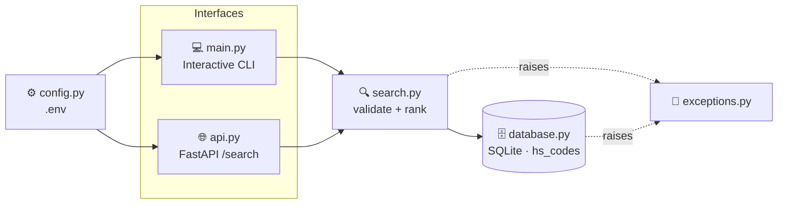

<div align="center">

# 🛃 CustomsIQ

### Trade compliance toolkit for customs & foreign trade operations
**Turn a plain-language product description into the right HS / GTİP tariff code.**

[](https://github.com/Mutersec/CustomsIQ/actions/workflows/ci.yml)


**🇬🇧 English** · [🇹🇷 Türkçe](README.tr.md) · [🇩🇪 Deutsch](README.de.md)

</div>

---

## 📑 Table of contents

| | | |
|---|---|---|
| [🎯 Problem](#-problem) | [✨ Features](#-features) | [🏗️ Architecture](#️-architecture) |
| [🧠 Design decisions](#-design-decisions) | [⚙️ Setup](#️-setup) | [🚀 Usage](#-usage) |
| [🌐 API reference](#-api-reference) | [🧪 Quality & testing](#-quality--testing) | [📦 Sample data](#-sample-data) |
| [🗺️ Roadmap](#️-roadmap) | [📁 Project layout](#-project-layout) | [📄 License](#-license) |

---

## 🎯 Problem

Assigning the correct **HS code** (Turkish: *GTİP — Gümrük Tarife İstatistik Pozisyonu*) is one of
the slowest and most error-prone steps in a customs declaration. Today it is done by hand, against a
tariff schedule with tens of thousands of lines.

| Pain point | Business consequence |
|---|---|
| 🔍 Manual lookup across a huge tariff schedule | Slow declarations; results depend on which operator is on shift |
| ❌ Misclassification | Wrong duty rate, penalties, held shipments |
| 🧠 Knowledge locked in people's heads | Slow onboarding, no auditable rationale for a chosen code |

**CustomsIQ automates the first pass:** give it a plain-language product description, get back a
ranked shortlist of tariff codes with a similarity score — a starting point a human expert confirms,
not a black box that decides alone.

---

## ✨ Features

| | Feature | Description |
|---|---|---|
| 🔍 | **Fuzzy search** | Free-text description → HS codes ranked by similarity score |
| 💻 | **Interactive CLI** | Type a description, get instant ranked results in the terminal |
| 🌐 | **REST API** | `GET /search` served by FastAPI, with auto-generated `/docs` |
| 🗄️ | **Zero-setup storage** | SQLite via the standard library, seeded with 20 demo codes |
| ⚙️ | **Env-based config** | `pydantic-settings` reads `.env` — no hardcoded paths |
| 🚨 | **Typed errors** | `InvalidQueryError`, `HSCodeNotFoundError` → clean HTTP 400 / 404 semantics |
| 🧪 | **Enforced quality** | ruff + black + mypy + 97% coverage, gated in CI on every push |

---

## 🏗️ Architecture

The CLI and the HTTP API are **thin adapters over one shared `search()` function** — ranking logic
exists in exactly one place and is never duplicated.



### Module responsibilities

| Module | Responsibility |
|---|---|
| `models.py` | `HSCode` — the immutable `(code, description, category)` record |
| `database.py` | SQLite schema, connection, seed data, `fetch_all()`, `get_by_code()` |
| `search.py` | Query validation + `difflib` similarity ranking (**the single source of truth**) |
| `exceptions.py` | `CustomsIQError` → `InvalidQueryError`, `HSCodeNotFoundError` |
| `config.py` | `pydantic-settings`; reads `CUSTOMSIQ_*` env vars and `.env` |
| `logging_config.py` | Shared logging setup — plain formatter to stdout, no `print()` anywhere |
| `main.py` | Interactive CLI entry point |
| `api.py` | FastAPI app: `GET /` and `GET /search` |

### Data model

```sql
CREATE TABLE hs_codes (
    code        TEXT PRIMARY KEY,   -- e.g. "6109100000"
    description TEXT NOT NULL,      -- e.g. "Cotton T-shirts, knitted"
    category    TEXT NOT NULL       -- e.g. "Textile"
);
```

---

## 🧠 Design decisions

### Why `difflib` instead of `rapidfuzz` / `thefuzz`?

`difflib.SequenceMatcher` ships with Python. That means **zero extra dependencies**, nothing to pin
or audit, and no install friction — while being entirely adequate at the current data scale.

| | `difflib` *(chosen)* | `rapidfuzz` |
|---|---|---|
| **Dependency** | ✅ Standard library | ⚠️ Third-party + C extension |
| **Speed at ~10² rows** | ✅ Imperceptible | ✅ Imperceptible |
| **Speed at ~10⁵ rows** | ❌ Noticeably slow | ✅ C-optimized, far faster |
| **Word-order tolerance** | ❌ Positional matching only | ✅ `token_sort` / `token_set` scorers |
| **Batch throughput** | ❌ Pure Python | ✅ `process.extract`, multi-threaded |

### 🔀 When to migrate

Swap `_similarity()` in `search.py` for `rapidfuzz.fuzz.WRatio` as soon as **any** of these becomes true:

1. **📈 Scale** — the real tariff schedule (tens of thousands of rows) makes the linear scan measurably slow.
2. **🔤 Word order** — queries like *"trousers cotton men's"* must match *"Men's cotton trousers"*, which positional matching handles poorly.
3. **⚡ Throughput** — a batch reclassification job needs thousands of queries per second.

> The swap is contained to **one function**, so this stays a cheap decision to make later — not a
> design commitment being made today.

### Other deliberate calls

| Decision | Rationale | Upgrade path |
|---|---|---|
| **SQLite, not Postgres** | Single-node, read-mostly reference data; zero ops overhead | Swap the connection layer if multi-writer concurrency arrives |
| **One shared connection** with `check_same_thread=False` | Simple, works with FastAPI's threadpool | Connection pool once concurrent writes appear |
| **Logging, not `print()`** | Same output path for CLI and API; level controlled by config | — |
| **Validation inside `search()`** | Both CLI and API inherit it; impossible to bypass by adding a new caller | — |

---

## ⚙️ Setup

```bash
# 1. Clone
git clone https://github.com/Mutersec/CustomsIQ.git
cd CustomsIQ

# 2. Virtual environment
python3 -m venv .venv
source .venv/bin/activate          # Windows: .venv\Scripts\activate

# 3. Dependencies
pip install -r requirements.txt

# 4. (Optional) configuration
cp .env.example .env
```

### Configuration

All settings are read from environment variables or `.env`:

| Variable | Default | Description |
|---|---|---|
| `CUSTOMSIQ_DATABASE_PATH` | `customsiq.db` | SQLite file path (`:memory:` for an ephemeral DB) |
| `CUSTOMSIQ_LOG_LEVEL` | `INFO` | Python log level (`DEBUG`, `INFO`, `WARNING`, …) |

---

## 🚀 Usage

### 💻 Interactive CLI

```bash
python -m src.customsiq.main
```

```text
seeded 20 HS code records
CustomsIQ - HS Code Search (type 'quit' to exit)

Product description: cotton t-shirt
1. 6109100000  (74%)  Cotton T-shirts, knitted        [Textile]
2. 6203420000  (57%)  Men's cotton trousers           [Textile]
3. 6204620000  (54%)  Women's cotton trousers         [Textile]
4. 6110200000  (42%)  Cotton pullovers and sweaters   [Textile]
5. 8528721000  (35%)  Color television receivers      [Electronics]
```

### 🌐 REST API

```bash
uvicorn src.customsiq.api:app --reload
```

Then open **http://localhost:8000/docs** for the interactive Swagger UI.

```bash
curl "http://localhost:8000/search?q=cotton+t-shirt&limit=2"
```

```json
[
  {
    "code": "6109100000",
    "description": "Cotton T-shirts, knitted",
    "category": "Textile",
    "score": 0.7368421052631579
  },
  {
    "code": "6203420000",
    "description": "Men's cotton trousers",
    "category": "Textile",
    "score": 0.5714285714285714
  }
]
```

### 🐍 As a library

```python
from src.customsiq.database import get_connection, seed
from src.customsiq.search import search

conn = get_connection("customsiq.db")
seed(conn)

for result in search(conn, "lithium battery", limit=3):
    print(f"{result.hs_code.code}  {result.score:.0%}  {result.hs_code.description}")
```

---

## 🌐 API reference

| Method | Endpoint | Description |
|---|---|---|
| `GET` | `/` | Service info — `{"service": "CustomsIQ API", "docs": "/docs", "status": "running"}` |
| `GET` | `/search` | Ranked HS code matches for a product description |
| `GET` | `/docs` | Interactive Swagger UI (auto-generated) |

**`GET /search` parameters**

| Parameter | Type | Default | Constraints | Description |
|---|---|---|---|---|
| `q` | `str` | *required* | 1–500 chars, not blank | Free-text product description |
| `limit` | `int` | `5` | 1–50 | Maximum number of results |

**Status codes**

| Code | Meaning |
|---|---|
| `200` | Success — array of matches (may be empty) |
| `400` | `InvalidQueryError` — blank query, or longer than 500 characters |
| `422` | Missing/invalid parameter type (FastAPI validation) |

---

## 🧪 Quality & testing

Every push and pull request runs the full gate via [GitHub Actions](.github/workflows/ci.yml):


```bash
ruff check .                                                  # lint
black .                                                       # format
mypy src                                                      # type check
pytest --cov --cov-report=term-missing --cov-fail-under=80    # tests + coverage gate
```

### Current coverage

| Module | Coverage |
|---|---|
| `api.py` · `config.py` · `database.py` | 🟢 100% |
| `exceptions.py` · `logging_config.py` · `models.py` · `search.py` | 🟢 100% |
| `main.py` | 🟢 90% |
| **Total** | **🟢 97.5%** (20 tests, gate at 80%) |

### Edge cases under test

| Case | Expected behaviour |
|---|---|
| Empty / whitespace-only query | `InvalidQueryError` → HTTP `400` |
| Query longer than 500 characters | `InvalidQueryError` → HTTP `400` |
| SQL-injection-shaped input (`'; DROP TABLE hs_codes; --`) | Handled safely by parameterized queries; table intact |
| Emoji & non-ASCII input (`📱 telefon şarj aleti`) | Scored normally, no crash |
| Unknown exact code lookup | `HSCodeNotFoundError` |
| Re-seeding a populated database | Idempotent — no duplicate rows |

---

## 📦 Sample data

The database is seeded with **20 representative HS codes across 8 categories**:

| Category | Codes |
|---|---|
| 📱 Electronics | 5 |
| 👕 Textile | 5 |
| 🍫 Food | 5 |
| 💊 Pharmaceutical · 🚗 Automotive · 🪑 Furniture · 🧴 Plastics · 🔩 Metals | 1 each |

<details>
<summary><b>Show all 20 seeded codes</b></summary>

| HS code | Description | Category |
|---|---|---|
| `8517120000` | Mobile phones and smartphones | Electronics |
| `8471300000` | Portable automatic data processing machines (laptops) | Electronics |
| `8528721000` | Color television receivers | Electronics |
| `8544421000` | USB cables and data cables | Electronics |
| `8507600000` | Lithium-ion batteries | Electronics |
| `6109100000` | Cotton T-shirts, knitted | Textile |
| `6203420000` | Men's cotton trousers | Textile |
| `6204620000` | Women's cotton trousers | Textile |
| `6110200000` | Cotton pullovers and sweaters | Textile |
| `6402990000` | Footwear with rubber or plastic soles | Textile |
| `0901210000` | Roasted coffee, not decaffeinated | Food |
| `1806320000` | Chocolate blocks, not filled | Food |
| `2009110000` | Frozen orange juice | Food |
| `0406100000` | Fresh cheese | Food |
| `1905310000` | Sweet biscuits | Food |
| `3004900000` | Medicaments for therapeutic use | Pharmaceutical |
| `4011100000` | New pneumatic tires for cars | Automotive |
| `9403300000` | Wooden office furniture | Furniture |
| `3926909700` | Plastic household articles | Plastics |
| `7326909800` | Miscellaneous articles of iron or steel | Metals |

</details>

> ⚠️ This is **demo data** for development and testing. Production use requires the official
> tariff schedule published by the Turkish Ministry of Trade.

---

## 🗺️ Roadmap

The HS code module ships today. Three further compliance modules are scaffolded and awaiting
implementation — they are excluded from the coverage gate until they have real logic:

| Module | Status | Planned scope |
|---|---|---|
| `search.py` + `api.py` | ✅ **Shipped** | Fuzzy HS code search via CLI and REST |
| `gtip_classifier.py` | 🚧 Scaffolded | Rule- and confidence-based classification, JSON-backed dataset |
| `tariff_calculator.py` | 🚧 Scaffolded | Duty calculation, origin rules, preferential trade agreement rates |
| `embargo_screener.py` | 🚧 Scaffolded | Sanctions list screening for entities, countries and products |

---

## 📁 Project layout

```text
CustomsIQ/
├── .github/workflows/ci.yml     # ruff → black → mypy → pytest
├── src/
│   ├── customsiq/
│   │   ├── models.py            # HSCode record
│   │   ├── database.py          # SQLite layer + seed data
│   │   ├── search.py            # validation + similarity ranking
│   │   ├── exceptions.py        # typed error hierarchy
│   │   ├── config.py            # pydantic-settings / .env
│   │   ├── logging_config.py    # shared logging setup
│   │   ├── main.py              # CLI entry point
│   │   ├── api.py               # FastAPI app
│   │   ├── gtip_classifier.py   # 🚧 scaffolded
│   │   ├── tariff_calculator.py # 🚧 scaffolded
│   │   └── embargo_screener.py  # 🚧 scaffolded
│   └── utils/validators.py      # GTİP format & country code validation
├── tests/                       # 20 tests — unit, API, CLI, edge cases
├── pyproject.toml               # ruff · black · mypy · pytest · coverage
├── requirements.txt
└── .env.example
```

---

## 📄 License

Released under the **MIT License**.

<div align="center">

**🇬🇧 English** · [🇹🇷 Türkçe](README.tr.md) · [🇩🇪 Deutsch](README.de.md)

</div>
