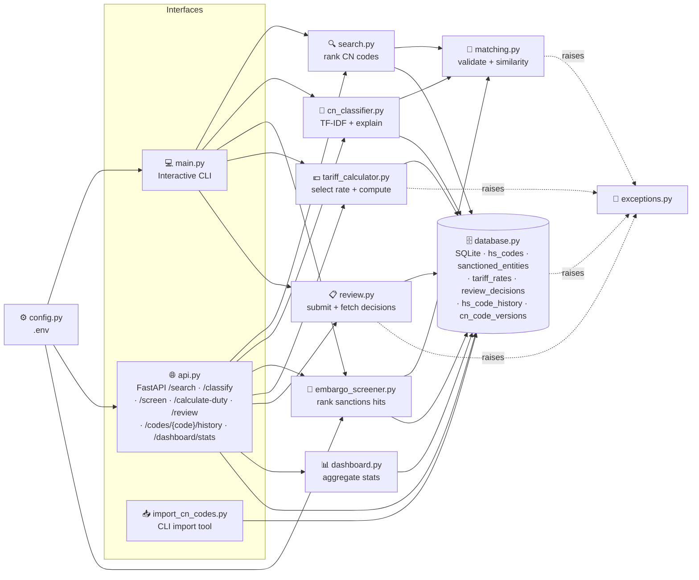

<div align="center">

# 🛃 CustomsIQ

### Trade compliance toolkit for customs & foreign trade operations
**Classify goods under the right HS / CN tariff code, screen counterparties against sanctions
lists, and calculate the duty owed.**

[](https://github.com/Mutersec/CustomsIQ/actions/workflows/ci.yml)


**[🌐 Live demo](https://customsiq-gs0u.onrender.com/)** · [📖 API reference](https://customsiq-gs0u.onrender.com/docs)

<sub>Hosted on a free Render instance that sleeps when idle — the first request may take ~30 s to wake.</sub>

**🇬🇧 English** · [🇹🇷 Türkçe](README.tr.md) · [🇩🇪 Deutsch](README.de.md)

</div>

---

> **ℹ️ About the demo dataset.** The live demo runs on a small curated dataset (20 HS codes) for
> fast cold starts on Render's free tier, where the filesystem resets on inactivity. The import
> pipeline has been verified end-to-end against realistic CN-format data (see
> [Importing the real CN nomenclature](#importing-the-real-cn-nomenclature) below) — running it
> against the full EU dataset locally, or on a persistent-disk deployment, populates the same
> schema the live demo uses.

---

## 📑 Table of contents

| | | |
|---|---|---|
| [🎯 Problem](#-problem) | [✨ Features](#-features) | [🏗️ Architecture](#️-architecture) |
| [🧠 Design decisions](#-design-decisions) | [⚙️ Setup](#️-setup) | [🚀 Usage](#-usage) |
| [🌐 API reference](#-api-reference) | [🧪 Quality & testing](#-quality--testing) | [📦 Sample data](#-sample-data) |
| [🗺️ Roadmap](#️-roadmap) | [📁 Project layout](#-project-layout) | [📄 License](#-license) |

---

## 🎯 Problem

Assigning the correct **CN code** (the EU *Combined Nomenclature*, which extends the international
HS code to 8 digits, and to 10 in TARIC) is one of the slowest and most error-prone steps in a
customs declaration. Today it is done by hand, against a tariff schedule with tens of thousands of
lines.

| Pain point | Business consequence |
|---|---|
| 🔍 Manual lookup across a huge tariff schedule | Slow declarations; results depend on which operator is on shift |
| ❌ Misclassification | Wrong duty rate, penalties, held shipments |
| 🧠 Knowledge locked in people's heads | Slow onboarding, no auditable rationale for a chosen code |

**CustomsIQ automates the first pass:** give it a plain-language product description, get back a
ranked shortlist of tariff codes with a similarity score — a starting point a human expert confirms,
not a black box that decides alone.

---

## ✨ Features

| | Feature | Description |
|---|---|---|
| 🔍 | **Fuzzy search** | Free-text description → CN/TARIC codes ranked by similarity score |
| 🧠 | **Code classification** | TF-IDF suggestions with a confidence score and the terms behind each |
| 🚫 | **Sanctions screening** | Name → denied-party hits, tolerant of word order and partial names |
| 💶 | **Duty calculation** | Code + origin + value → duty owed, with the rate and reason explained |
| 📋 | **Human-review audit trail** | Approve/reject/flag any classification, screening or duty result — append-only |
| 🕘 | **Versioned CN codes (SCD Type 2)** | Every changed description/category keeps its prior value, timestamped, via `GET /codes/{code}/history` |
| 📊 | **Analytics dashboard** | Read-only overview of reference data, review activity and import runs via `GET /dashboard/stats` |
| 🖥️ | **Web UI** | Single-page frontend served at `/` — no build step, no framework, no CDN |
| 📥 | **Real-data import** | Load the official EU CN nomenclature from a local file, versioning any changes |
| 💻 | **Interactive CLI** | Search codes or run `screen <name>` from the same prompt |
| 🌐 | **REST API** | `GET /search` and `GET /screen` on FastAPI, with auto-generated `/docs` |
| 🗄️ | **Zero-setup storage** | SQLite via the standard library, seeded with 20 codes + 18 mock entities |
| ⚙️ | **Env-based config** | `pydantic-settings` reads `.env` — no hardcoded paths or thresholds |
| 🚨 | **Typed errors** | `InvalidQueryError`, `HSCodeNotFoundError` → clean HTTP 400 / 404 semantics |
| 🧪 | **Enforced quality** | ruff + black + mypy + 98% coverage, gated in CI on every push |

---

## 🏗️ Architecture

Two features — **CN code search** and **sanctions screening** — sit on one shared matching layer.
The CLI and the HTTP API are thin adapters over `search()` and `screen_entity()`; scoring and
validation logic exists in exactly one place and is never duplicated.



### Module responsibilities

| Module | Responsibility |
|---|---|
| `models.py` | `HSCode`, `SanctionedEntity`, `TariffRate`, `ReviewDecision`, `HSCodeVersion` and `ImportRun` — the immutable records |
| `database.py` | SQLite schema, connection, seed data, `fetch_all*()`, `get_by_code()`, `upsert_hs_codes_with_history()` (SCD Type 2) |
| `matching.py` | Input validation + similarity scoring (**shared by both features**) |
| `search.py` | Ranks CN codes by description similarity |
| `cn_classifier.py` | Suggests codes by TF-IDF term weighting, reporting the terms that matched |
| `embargo_screener.py` | Ranks sanctions-list hits by name similarity |
| `tariff_calculator.py` | Selects the applicable duty rate and computes what is owed |
| `review.py` | Records and lists human reviewer sign-offs on past decisions (audit trail) |
| `dashboard.py` | Read-only aggregation of reference data, review activity and CN imports for `/dashboard/stats` |
| `exceptions.py` | `CustomsIQError` → `InvalidQueryError`, `HSCodeNotFoundError`, `RateNotFoundError` |
| `config.py` | `pydantic-settings`; reads `CUSTOMSIQ_*` env vars and `.env` |
| `logging_config.py` | Shared logging setup — plain formatter to stdout, no `print()` anywhere |
| `main.py` | Interactive CLI entry point (search + `screen <name>`) |
| `api.py` | FastAPI app: serves the frontend at `/`, plus `/search`, `/classify`, `/screen`, `/calculate-duty`, `/review`, `/review/history`, `/codes/{code}/history`, `/health` |
| `scripts/import_cn_codes.py` | CLI import tool: parses a CN export and versions any changes via `upsert_hs_codes_with_history()` |
| `static/index.html` | The whole web frontend — inline CSS, vanilla `fetch()`, zero dependencies |

### Data model

```sql
CREATE TABLE hs_codes (
    code        TEXT PRIMARY KEY,   -- e.g. "6109100000"
    description TEXT NOT NULL,      -- e.g. "Cotton T-shirts, knitted"
    category    TEXT NOT NULL       -- e.g. "Textile"
);

CREATE TABLE sanctioned_entities (
    name        TEXT PRIMARY KEY,   -- e.g. "Northwind Maritime Holdings Ltd"
    country     TEXT NOT NULL,      -- ISO 3166-1 alpha-2, e.g. "CY"
    list_source TEXT NOT NULL,      -- e.g. "EU Consolidated Financial Sanctions List"
    date_added  TEXT NOT NULL       -- ISO 8601 date, e.g. "2023-04-12"
);

CREATE TABLE tariff_rates (
    hs_code           TEXT NOT NULL,  -- e.g. "6109100000"
    country_of_origin TEXT NOT NULL,  -- ISO alpha-2, or "ALL" for a standard MFN rate
    rate_type         TEXT NOT NULL,  -- "standard" or "preferential"
    rate_percent      REAL NOT NULL,  -- e.g. 12.0
    trade_agreement   TEXT,           -- NULL for standard rates
    valid_from        TEXT NOT NULL,  -- ISO 8601 date the rate takes effect
    PRIMARY KEY (hs_code, country_of_origin, valid_from)
);

CREATE TABLE review_decisions (
    id                 INTEGER PRIMARY KEY AUTOINCREMENT,  -- audit rows have no natural key
    subject_type       TEXT NOT NULL,   -- "classification" | "screening" | "duty"
    subject_reference  TEXT NOT NULL,   -- sha256(subject_type + normalized input), see below
    decision           TEXT NOT NULL,   -- "approved" | "rejected" | "flagged"
    reviewer_name      TEXT NOT NULL,   -- free text — stand-in until authenticated users exist
    comment            TEXT,            -- optional note
    reviewed_at        TEXT NOT NULL    -- ISO 8601 timestamp
);

CREATE TABLE hs_code_history (
    id            INTEGER PRIMARY KEY AUTOINCREMENT,  -- history rows have no natural key
    code          TEXT NOT NULL,     -- the hs_codes.code this version belongs to
    description   TEXT NOT NULL,     -- the description as it read during this version
    category      TEXT NOT NULL,     -- the category as it read during this version
    valid_from    TEXT NOT NULL,     -- ISO 8601 timestamp this version became current
    valid_to      TEXT,              -- ISO 8601 timestamp superseded, NULL if still current
    version_label TEXT NOT NULL      -- the import run that produced this version, e.g. "CN2026"
);

CREATE TABLE cn_code_versions (
    id                  INTEGER PRIMARY KEY AUTOINCREMENT,
    version_label       TEXT NOT NULL,     -- e.g. "CN2026"
    source_description  TEXT,              -- e.g. the imported file's name
    imported_at         TEXT NOT NULL,     -- ISO 8601 timestamp the run completed
    row_count           INTEGER NOT NULL   -- leaf CN codes processed in this run
);
```

---

## 🧠 Design decisions

### Why `difflib` instead of `rapidfuzz` / `thefuzz`?

`difflib.SequenceMatcher` ships with Python. That means **zero extra dependencies**, nothing to pin
or audit, and no install friction — while being entirely adequate at the current data scale.

| | `difflib` *(chosen)* | `rapidfuzz` |
|---|---|---|
| **Dependency** | ✅ Standard library | ⚠️ Third-party + C extension |
| **Speed at ~10² rows** | ✅ Imperceptible | ✅ Imperceptible |
| **Speed at ~10⁵ rows** | ❌ Noticeably slow | ✅ C-optimized, far faster |
| **Word-order tolerance** | ❌ Positional matching only | ✅ `token_sort` / `token_set` scorers |
| **Batch throughput** | ❌ Pure Python | ✅ `process.extract`, multi-threaded |

### 🔀 When to migrate

Swap `similarity()` in `matching.py` for `rapidfuzz.fuzz.WRatio` as soon as **any** of these becomes true:

1. **📈 Scale** — the real tariff schedule (tens of thousands of rows) makes the linear scan measurably slow.
2. **🔤 Word order** — queries like *"trousers cotton men's"* must match *"Men's cotton trousers"*, which positional matching handles poorly.
3. **⚡ Throughput** — a batch reclassification job needs thousands of queries per second.

> The swap is contained to **one function**, so this stays a cheap decision to make later — not a
> design commitment being made today.

### Other deliberate calls

| Decision | Rationale | Upgrade path |
|---|---|---|
| **SQLite, not Postgres** | Single-node, read-mostly reference data; zero ops overhead | Swap the connection layer if multi-writer concurrency arrives |
| **One shared connection** with `check_same_thread=False` | Simple, works with FastAPI's threadpool | Connection pool once concurrent writes appear |
| **Logging, not `print()`** | Same output path for CLI and API; level controlled by config | — |
| **No `EmbargoScreeningError`** | Screening's input validation is identical to search's, so it reuses `InvalidQueryError` rather than duplicating a class | Add one if screening grows a genuinely distinct failure mode |
| **Validation inside `matching.py`** | Search, screening, CLI and API all inherit it; impossible to bypass by adding a new caller | — |
| **`review_decisions` uses `INTEGER PRIMARY KEY AUTOINCREMENT`**, unlike the other three tables | Audit rows aren't naturally unique — the same `subject_reference` can legitimately get several decisions over time | — |
| **`review_decisions` is append-only** | Models the four-eyes / human-review principle common in trade compliance tools like SAP GTS: a corrected decision is a new row, never an edit, so the history is never lost. `reviewer_name` is free text in this demo; a production system would tie this to authenticated users (see Roadmap) | Add authenticated users + RBAC |
| **CN code history lives in a separate `hs_code_history` table**, not `valid_from`/`valid_to` columns added onto `hs_codes` itself | `hs_codes` keeps its existing `code TEXT PRIMARY KEY` and its two read functions (`fetch_all`, `get_by_code`) stay byte-for-byte unchanged — nothing to filter, nothing to forget. It's also the only migration-safe option: this project has no schema migrations, and `CREATE TABLE IF NOT EXISTS` never alters an existing table, so columns added to `hs_codes` would never appear in anyone's existing `customsiq.db` file | Backfill an opening history row per pre-existing code if a real deployment needs full-depth history from day one |

### 🕘 Versioned CN codes (SCD Type 2)

Re-importing CN reference data used to silently overwrite `hs_codes` in place
(`ON CONFLICT DO UPDATE`) — if a classification or duty decision was made against an old
description and the nomenclature was later re-imported with changed data, there was no way to
reconstruct what the system "knew" at decision time. `scripts/import_cn_codes.py` now versions
every actual change using the SCD Type 2 pattern common in BI/data-warehouse tooling (SAP BW's
change-document tables are the same idea): `hs_codes` still holds one current row per code, exactly
as before, while `hs_code_history` keeps every prior value, closed rather than deleted.

Importing "CN2025" (a new code), then "CN2026" (the same code, description reworded):

| Table | After CN2025 | After CN2026 |
|---|---|---|
| `hs_codes` | `6109100000` → *"Cotton T-shirts, knitted"* | `6109100000` → *"Cotton T-shirts, knitted or crocheted"* (old value gone here, exactly like today) |
| `hs_code_history` | one open row: *"...knitted"*, `valid_to = NULL`, `version_label = "CN2025"` | that row now **closed** (`valid_to` set) **plus a new open row**: *"...knitted or crocheted"*, `version_label = "CN2026"` |
| `cn_code_versions` | `CN2025`, `row_count = 1` | `CN2026`, `row_count = 1` |

`GET /codes/6109100000/history` returns both `hs_code_history` rows, oldest first — the old
description survives, it isn't deleted. Re-importing "CN2026" a second time with **identical**
data adds nothing to either history table: only `cn_code_versions` logs that the run happened,
with 0 changes. `search.py`, `cn_classifier.py`, `tariff_calculator.py` and `embargo_screener.py`
are untouched by any of this — `tariff_calculator.py` never reads `hs_codes` at all, and the other
two already call `fetch_all()`/nothing-else, which returns exactly what it always did.

This also strengthens the audit trail from the human-review layer: `review_decisions` records
*that* a decision was reviewed, and CN code history now makes it possible to reconstruct what
nomenclature data was active at that time.

### 📊 Dashboard: the reporting layer over Phases 1 & 2

`dashboard.py` adds no new business logic and makes no decisions — it's a read-only aggregation
of what `review.py` and the CN pipeline already recorded, composing existing `database.py` reads
(`fetch_all`, `fetch_all_entities`, `fetch_review_decisions`, `fetch_cn_import_runs`, plus two
small new counting primitives) into one `GET /dashboard/stats` call for the frontend's Dashboard
panel. One adaptation worth noting: `cn_code_versions` (Phase 2) only ever stored `row_count`
per import run, not a new/changed/unchanged split — that split existed only transiently inside
`upsert_hs_codes_with_history()` and was never persisted. Rather than add columns to store it
retroactively, the dashboard derives **changed vs. unchanged** per run from how many
`hs_code_history` rows carry that run's `version_label` (one `GROUP BY` query, not three
separate counts) — an honest reading of what was actually recorded, not a fabricated breakdown.

### 🔗 Deterministic `subject_reference`

Every reviewable result carries a `subject_reference` — `sha256(f"{subject_type}:{normalized_input}")`
— so that submitting the *same* query twice always audits the *same* subject, letting repeat
submissions link to one shared review history instead of forking a new one each time. The
`subject_type` prefix keeps the three features from ever colliding on the same hash.

Normalization is deliberately case-folding for text inputs (the underlying decision doesn't change
with capitalization) but exact for money (a different customs value **is** a different decision):

| Subject type | Input | `subject_reference` | Same input again? |
|---|---|---|---|
| classification | `"knitted cotton shirt"` | `ca8b1b95…fc3407` | Identical |
| classification | `"KNITTED COTTON SHIRT"` | `ca8b1b95…fc3407` | **Same as above** — case is folded before hashing |
| screening | `"Northwind Maritime"` | `fa9ec5ed…b32c38c` | Identical |
| duty | `hs_code=6109100000, country=DE, value=1000.00` | `8e4b03f6…602e3c2e` | Identical |
| duty | `hs_code=6109100000, country=DE, value=1000.01` | `0a16c715…9c8f53` | **Different** — a different value is a different decision to audit |

(Full hashes and the same assertions live in `tests/test_review.py::TestDeterminism`.)

### 🧠 `/search` vs `/classify` — two algorithms, one dataset

Both rank the same `hs_codes` table, but they answer different questions and fail in different
ways. `/search` is a **lookup**: fast character overlap, good when you roughly know the wording.
`/classify` is a **suggestion engine**: it weighs how *rare* each word is across the nomenclature,
so a distinctive term counts for more than a common one, and it reports which of your terms drove
each hit.

Measured on the sample corpus:

| Query | `/search` (difflib) | `/classify` (TF-IDF) | |
|---|---|---|---|
| `knitted cotton shirt` | `6203420000` Men's cotton **trousers** | `6109100000` **Cotton T-shirts, knitted** | ✅ classify right |
| `lithium battery` | `8507600000` Lithium-ion batteries | same | tie |
| `laptop` | `3926909700` Plastic household articles | `8471300000` laptops | ✅ classify right |

Row 1 is the case that justifies the module: `knitted` appears in only one description, so term
weighting lets it dominate, while character overlap is swayed by the bulk of letters shared with
"cotton trousers". Row 3 shows the reverse failure — difflib returns *something* regardless, where
classify returns nothing when no term is shared rather than dressing noise up as a suggestion.

**Why hand-rolled TF-IDF and not scikit-learn.** The implementation is sklearn's own formula
(smoothed IDF `log((N+1)/(df+1))+1`, L2-normalised vectors, cosine via dot product) in ~40 lines of
stdlib arithmetic, so `TfidfVectorizer` would rank this data near-identically — there is no
accuracy gap to close. Against that: scikit-learn pulls numpy and scipy (~100 MB) into the
production image to rank a 20-row table. And decisively, **explainability would cost more code with
sklearn, not less** — here each term's contribution is `query_weight × doc_weight`, already computed
on the way to the score; with sklearn it would mean reaching into `vectorizer.vocabulary_` and
indexing back into a sparse matrix to recover the same numbers.

Adopt scikit-learn if the corpus passes ~10⁵ rows, or if n-grams or sublinear term frequency are
needed. Before that, the classifier index is rebuilt per call — 0.1 ms at 20 codes, ~68 ms at
10 000 — so caching it is the first optimisation, not a new dependency.

**One measured wrinkle:** CN descriptions are written in the plural ("cables", "batteries") while
users type the singular. Without plural folding, `cable`, `biscuit`, `laptop` and `battery` each
scored **zero against every code**. The tokenizer therefore folds `-ies → y`, sibilant `-es`, and
`-s`. It is not a stemmer — just the English plural rule the corpus demands.

### 🚫 Name matching is not product matching

Sanctions screening reuses the same `difflib` core for consistency and zero dependencies, but
names needed two extra signals on top of the plain ratio. Measured against the demo list:

| Query vs. listed name | plain | token-sorted | token overlap |
|---|---|---|---|
| `John Smith` vs `Smith, John` | 0.50 ❌ | **1.00** ✅ | 1.00 |
| `Northwind Maritime` vs `Northwind Maritime Holdings Ltd` | 0.73 ❌ | 0.73 ❌ | **1.00** ✅ |
| `Smith` vs `John Smith` | 0.67 | 0.67 | 1.00 ⚠️ |

Word-order variants need **token sorting**; partial company names need a **token-overlap** term,
since at a 0.75 threshold both other signals miss row 2 outright. The overlap term is only trusted
when the shorter name has ≥ 2 tokens — otherwise a lone surname (row 3) matches every record
containing it. Screening takes the max of the applicable signals and is deliberately
over-inclusive: a false negative lets a sanctioned party through, a false positive costs an
analyst one glance.

**This — not product search — is what will justify `rapidfuzz` first.** Those two signals are
hand-rolled versions of its `token_sort_ratio` and `token_set_ratio`, and it also brings
`partial_ratio` and far faster scanning. The real EU Consolidated Financial Sanctions List holds
thousands of entries, rescanned on every screen, and needs alias and transliteration handling that
`difflib` has no answer for.

### 🇪🇺 EU alignment

> Data model and terminology align with EU Combined Nomenclature and EU trade compliance
> frameworks, reflecting the target market (EU-based trade compliance roles).

Concretely, this means:

| Concern | Source of truth |
|---|---|
| Tariff codes & nomenclature | [EU TARIC database](https://ec.europa.eu/taxation_customs/dds2/taric) — CN-8 codes, TARIC-10 with EU subheadings |
| Sanctions & embargo screening | EU Consolidated Financial Sanctions List |
| Preferential duty rates | EU trade agreements |

---

## ⚙️ Setup

```bash
# 1. Clone
git clone https://github.com/Mutersec/CustomsIQ.git
cd CustomsIQ

# 2. Virtual environment
python3 -m venv .venv
source .venv/bin/activate          # Windows: .venv\Scripts\activate

# 3. Dependencies
pip install -r requirements.txt

# 4. (Optional) configuration
cp .env.example .env
```

### Configuration

All settings are read from environment variables or `.env`:

| Variable | Default | Description |
|---|---|---|
| `CUSTOMSIQ_DATABASE_PATH` | `customsiq.db` | SQLite file path (`:memory:` for an ephemeral DB) |
| `CUSTOMSIQ_LOG_LEVEL` | `INFO` | Python log level (`DEBUG`, `INFO`, `WARNING`, …) |
| `CUSTOMSIQ_SCREENING_THRESHOLD` | `0.75` | Minimum name-similarity score (0–1) for a screening hit |

---

## 🚀 Usage

### 💻 Interactive CLI

```bash
python -m src.customsiq.main
```

```text
seeded 20 rows into hs_codes
seeded 18 rows into sanctioned_entities
CustomsIQ (type 'quit' to exit)
Enter a product description to search CN codes,
'classify <description>' for ranked suggestions with reasoning,
'screen <name>' to run a sanctions check,
or 'duty <hs_code> <country> <value>' to calculate customs duty.

> cotton t-shirt
1. 6109100000  (74%)  Cotton T-shirts, knitted        [Textile]
2. 6203420000  (57%)  Men's cotton trousers           [Textile]
3. 6204620000  (54%)  Women's cotton trousers         [Textile]
4. 6110200000  (42%)  Cotton pullovers and sweaters   [Textile]
5. 8528721000  (35%)  Color television receivers      [Electronics]

> screen Northwind Maritime
1 potential sanctions match(es) for 'Northwind Maritime':
1. Northwind Maritime Holdings Ltd  (100%)  [CY]  EU Consolidated Financial Sanctions List  listed 2023-04-12

> classify knitted cotton shirt
1. 6109100000  (85% confidence)  Cotton T-shirts, knitted  [Textile]  via: shirt, knitted, cotton
2. 6203420000  (19% confidence)  Men's cotton trousers  [Textile]  via: cotton

> screen Quokka Beachwear
No sanctions match for 'Quokka Beachwear'.

> duty 6109100000 NO 1000
Duty on 6109100000 from NO: 0.00 (0.00% preferential)
  Preferential rate of 0% applied under the EU-Solvia Free Trade Agreement, for which origin NO qualifies.
  Customs value 1000.00 + duty 0.00 = 1000.00

> review duty 8e4b03f6c0353ab018c024b6e7045251867255b083df5637f5d01ef5602e3c2e approved alice confirmed correct
Recorded: approved 1 on duty:8e4b03f6c0353ab018c024b6e7045251867255b083df5637f5d01ef5602e3c2e by alice at 2026-01-01T12:00:00+00:00

> review-history
2026-01-01T12:00:00+00:00  duty:8e4b03f6c0353ab018c024b6e7045251867255b083df5637f5d01ef5602e3c2e  approved  by alice  (confirmed correct)
```

### 🖥️ Web interface

```bash
uvicorn src.customsiq.api:app --reload
```

Try the **[live demo](https://customsiq-gs0u.onrender.com/)**, or open **http://localhost:8000/** for the web UI
when running locally — both features in one page.

### 🌐 REST API

The same server exposes the JSON API:

Then open **http://localhost:8000/docs** for the interactive Swagger UI.

```bash
curl "http://localhost:8000/search?q=cotton+t-shirt&limit=2"
```

```json
[
  {
    "code": "6109100000",
    "description": "Cotton T-shirts, knitted",
    "category": "Textile",
    "score": 0.7368421052631579
  },
  {
    "code": "6203420000",
    "description": "Men's cotton trousers",
    "category": "Textile",
    "score": 0.5714285714285714
  }
]
```

### 🐍 As a library

```python
from src.customsiq.database import get_connection, seed
from src.customsiq.search import search

conn = get_connection("customsiq.db")
seed(conn)

for result in search(conn, "lithium battery", limit=3):
    print(f"{result.hs_code.code}  {result.score:.0%}  {result.hs_code.description}")
```

---

## 🌐 API reference

| Method | Endpoint | Description |
|---|---|---|
| `GET` | `/` | **Web frontend** (HTML page) |
| `GET` | `/health` | Liveness check — `{"service": "CustomsIQ API", "docs": "/docs", "status": "running"}` |
| `GET` | `/search` | Ranked CN code matches for a product description |
| `GET` | `/classify` | Ranked code suggestions with confidence and matched terms |
| `GET` | `/screen` | Sanctions-list hits for a person or organisation name |
| `GET` | `/calculate-duty` | Duty owed on a consignment, with the applied rate explained |
| `POST` | `/review` | Record a reviewer's sign-off on a past classification, screening or duty result |
| `GET` | `/review/history` | Recorded review decisions, most recently reviewed first |
| `GET` | `/codes/{code}/history` | One CN code's SCD Type 2 version timeline, oldest first |
| `GET` | `/dashboard/stats` | Aggregate stats: reference data, review activity, CN import runs |
| `GET` | `/docs` | Interactive Swagger UI (auto-generated) |

**`GET /search` parameters**

| Parameter | Type | Default | Constraints | Description |
|---|---|---|---|---|
| `q` | `str` | *required* | 1–500 chars, not blank | Free-text product description |
| `limit` | `int` | `5` | 1–50 | Maximum number of results |

**`GET /classify` parameters**

| Parameter | Type | Default | Constraints | Description |
|---|---|---|---|---|
| `description` | `str` | *required* | 1–500 chars, not blank | Free-text description of the goods |
| `top_n` | `int` | `5` | 1–50 | Maximum number of suggestions |

```bash
curl "http://localhost:8000/classify?description=knitted+cotton+shirt&top_n=2"
```

```json
[
  {
    "code": "6109100000",
    "description": "Cotton T-shirts, knitted",
    "category": "Textile",
    "score": 0.8464917087617252,
    "matched_terms": ["shirt", "knitted", "cotton"],
    "subject_reference": "ca8b1b958f7a9136035ce4106495b252851544092bdce2797bc30b8687fc3407"
  },
  {
    "code": "6203420000",
    "description": "Men's cotton trousers",
    "category": "Textile",
    "score": 0.18940799593138907,
    "matched_terms": ["cotton"],
    "subject_reference": "ca8b1b958f7a9136035ce4106495b252851544092bdce2797bc30b8687fc3407"
  }
]
```

The runner-up scores far lower because it only shares the *common* word `cotton`, while the winner
also matched the rare `knitted` — `matched_terms` makes that visible rather than implicit.

**`GET /screen` parameters**

| Parameter | Type | Default | Constraints | Description |
|---|---|---|---|---|
| `name` | `str` | *required* | 1–500 chars, not blank | Person or organisation name to screen |

Screening takes no `limit`: every hit above the threshold is returned, since a silently truncated
hit list would be a compliance failure rather than just a worse ranking.

**`GET /calculate-duty` parameters**

| Parameter | Type | Default | Constraints | Description |
|---|---|---|---|---|
| `hs_code` | `str` | *required* | CN-8 or TARIC-10 | Code of the goods being imported |
| `country_of_origin` | `str` | *required* | ISO 3166-1 alpha-2 | Where the goods originate |
| `customs_value` | `float` | *required* | >= 0 | Declared customs value |

A preferential rate wins whenever the origin qualifies for one; otherwise the standard MFN rate
applies. A code with **no** rate on record returns `404` rather than zero duty — a gap in the
tariff data is not a duty-free import.

**`POST /review` body**

| Field | Type | Default | Constraints | Description |
|---|---|---|---|---|
| `subject_type` | `str` | *required* | `classification` \| `screening` \| `duty` | What kind of result is being reviewed |
| `subject_reference` | `str` | *required* | not blank | The `subject_reference` from that result — never re-typed, always the value the API already returned |
| `decision` | `str` | *required* | `approved` \| `rejected` \| `flagged` | The reviewer's verdict |
| `reviewer_name` | `str` | *required* | not blank | Free text — stand-in until authenticated users exist |
| `comment` | `str \| null` | `null` | — | Optional free-text note |

```bash
curl -X POST "http://localhost:8000/review" \
  -H "Content-Type: application/json" \
  -d '{"subject_type": "duty", "subject_reference": "8e4b03f6c0353ab018c024b6e7045251867255b083df5637f5d01ef5602e3c2e", "decision": "approved", "reviewer_name": "alice", "comment": "confirmed correct"}'
```

```json
{
  "id": 1,
  "subject_type": "duty",
  "subject_reference": "8e4b03f6c0353ab018c024b6e7045251867255b083df5637f5d01ef5602e3c2e",
  "decision": "approved",
  "reviewer_name": "alice",
  "comment": "confirmed correct",
  "reviewed_at": "2026-01-01T12:00:00+00:00"
}
```

**`GET /review/history` parameters**

| Parameter | Type | Default | Constraints | Description |
|---|---|---|---|---|
| `subject_type` | `str \| null` | `null` | `classification` \| `screening` \| `duty` | Restrict to this subject type |
| `subject_reference` | `str \| null` | `null` | — | Restrict to this subject |
| `limit` | `int` | `50` | 1–200 | Maximum number of decisions returned |

```bash
curl "http://localhost:8000/review/history?subject_type=duty&limit=10"
```

**`GET /codes/{code}/history`** — no parameters beyond the code itself. `404` if the code is
unknown; a code that exists but was never touched by a versioned import (e.g. the seeded demo
data) returns `200 []`, not an error — same "empty list, never an error" convention as `/search`.

```bash
curl "http://localhost:8000/codes/6109100000/history"
```

```json
[
  {
    "code": "6109100000",
    "description": "Cotton T-shirts, knitted",
    "category": "Textile",
    "valid_from": "2025-01-15T09:00:00+00:00",
    "valid_to": "2026-02-01T09:00:00+00:00",
    "version_label": "CN2025"
  },
  {
    "code": "6109100000",
    "description": "Cotton T-shirts, knitted or crocheted",
    "category": "Textile",
    "valid_from": "2026-02-01T09:00:00+00:00",
    "valid_to": null,
    "version_label": "CN2026"
  }
]
```

**`GET /dashboard/stats`** — no parameters, no input to validate. `review_by_decision` and
`review_by_subject_type` always carry all three keys, defaulted to `0`, so a fresh database
renders cleanly rather than forcing the caller to guard against missing keys.

```bash
curl "http://localhost:8000/dashboard/stats"
```

```json
{
  "hs_code_count": 20,
  "sanctioned_entity_count": 18,
  "tariff_rate_count": 18,
  "review_total": 2,
  "review_by_decision": { "approved": 1, "rejected": 0, "flagged": 1 },
  "review_by_subject_type": { "classification": 1, "screening": 0, "duty": 1 },
  "recent_reviews": [ { "id": 2, "subject_type": "duty", "decision": "flagged", "...": "..." } ],
  "import_run_count": 1,
  "recent_import_runs": [
    {
      "version_label": "CN2026",
      "source_description": "cn2026.csv",
      "imported_at": "2026-02-01T09:00:00+00:00",
      "row_count": 10,
      "changed_count": 1,
      "unchanged_count": 9
    }
  ],
  "versioned_code_count": 1
}
```

```bash
curl "http://localhost:8000/calculate-duty?hs_code=6109100000&country_of_origin=NO&customs_value=1000"
```

```json
{
  "hs_code": "6109100000",
  "country_of_origin": "NO",
  "customs_value": 1000.0,
  "rate_percent": 0.0,
  "rate_type": "preferential",
  "trade_agreement": "EU-Solvia Free Trade Agreement",
  "duty_amount": 0.0,
  "total_payable": 1000.0,
  "explanation": "Preferential rate of 0% applied under the EU-Solvia Free Trade Agreement, for which origin NO qualifies.",
  "subject_reference": "8e4b03f6c0353ab018c024b6e7045251867255b083df5637f5d01ef5602e3c2e"
}
```

```bash
curl "http://localhost:8000/screen?name=Northwind+Maritime"
```

```json
[
  {
    "name": "Northwind Maritime Holdings Ltd",
    "country": "CY",
    "list_source": "EU Consolidated Financial Sanctions List",
    "date_added": "2023-04-12",
    "score": 1.0,
    "subject_reference": "fa9ec5ed3f84ae68c8c5729faa18e043297e7ec78aae9ab89bebeef82b32c38c"
  }
]
```

**Status codes**

| Code | Meaning |
|---|---|
| `200` | Success — array of matches (may be empty) |
| `400` | `InvalidQueryError` — blank/oversized query, malformed code, or negative value |
| `404` | `RateNotFoundError` — no duty rate on record for that HS code, or `HSCodeNotFoundError` on `/codes/{code}/history` |
| `422` | Missing/invalid parameter type (FastAPI validation) |

---

## 🧪 Quality & testing

Every push and pull request runs the full gate via [GitHub Actions](.github/workflows/ci.yml):


```bash
ruff check .                                                  # lint
black .                                                       # format
mypy src                                                      # type check
pytest --cov --cov-report=term-missing --cov-fail-under=80    # tests + coverage gate
```

### Current coverage

| Module | Coverage |
|---|---|
| `api.py` · `config.py` · `database.py` · `embargo_screener.py` · `matching.py` | 🟢 100% |
| `cn_classifier.py` · `exceptions.py` · `models.py` · `search.py` · `tariff_calculator.py` · `review.py` · `dashboard.py` | 🟢 100% |
| `scripts/import_cn_codes.py` | 🟢 91% |
| `logging_config.py` | 🟢 100% |
| `main.py` | 🟢 97% |
| **Total** | **🟢 98%** (154 tests, gate at 80%) — **no module is excluded from the gate** |

### Edge cases under test

| Case | Expected behaviour |
|---|---|
| Empty / whitespace-only query or name | `InvalidQueryError` → HTTP `400` |
| Query longer than 500 characters | `InvalidQueryError` → HTTP `400` |
| SQL-injection-shaped input (`'; DROP TABLE hs_codes; --`) | Handled safely by parameterized queries; table intact |
| Emoji & non-ASCII input (`📱 Handy-Ladegerät`, `Ünal Çelik A.Ş.`) | Scored normally, no crash |
| Reversed name order (`Aleksandr Voronin-Teske`) | Matches the surname-first list entry |
| Partial company name (`Northwind Maritime`) | Matches the full listed name |
| Name matching nothing on the list | Empty result, not an error |
| Unknown exact code lookup | `HSCodeNotFoundError` |
| Description sharing no term with any code | Empty list, never a zero-confidence suggestion |
| Singular query against a plural description (`cable`, `battery`) | Folded and matched |
| Preferential rate available for the origin | Beats the standard MFN rate |
| Rate not yet in force (`valid_from` in the future) | Ignored; falls back to the rate in force |
| HS code with no rate on record | `RateNotFoundError` → HTTP `404`, never zero duty |
| Negative customs value | `InvalidQueryError` → HTTP `400` |
| Zero customs value | Valid — zero duty owed |
| Re-seeding a populated database | Idempotent — no duplicate rows in any table |
| Same classification/screening query, different case | Same `subject_reference` — case is folded before hashing |
| Same duty inputs, different `customs_value` | Different `subject_reference` — a different value is a different decision |
| Two review decisions on the same `subject_reference` | Both persist, most recent first — audit rows are never overwritten |
| Unknown `subject_type` or `decision` on `POST /review` | `InvalidQueryError` → HTTP `400` |
| Re-importing a code with a changed description/category | Old `hs_code_history` row closed (`valid_to` set), new one opened — never deleted |
| Re-importing a code with identical data | No new `hs_code_history` row; `hs_codes` gets a harmless no-op upsert |
| `GET /codes/{code}/history` for a seeded-but-never-versioned code | `200 []`, not an error |
| `GET /codes/{code}/history` for an unknown code | `HSCodeNotFoundError` → HTTP `404` |
| `GET /dashboard/stats` on a fresh database (no reviews, no imports) | All counts `0`, breakdown keys present not missing, empty lists — never `NaN%` on the frontend |

---

## 📦 Sample data

The database is seeded with **20 representative CN/TARIC codes across 8 categories**, written in
EU Combined Nomenclature style:

| Category | Codes |
|---|---|
| 📱 Electronics | 5 |
| 👕 Textile | 5 |
| 🍫 Food | 5 |
| 💊 Pharmaceutical · 🚗 Automotive · 🪑 Furniture · 🧴 Plastics · 🔩 Metals | 1 each |

<details>
<summary><b>Show all 20 seeded codes</b></summary>

| CN/TARIC code | Description | Category |
|---|---|---|
| `8517120000` | Mobile phones and smartphones | Electronics |
| `8471300000` | Portable automatic data processing machines (laptops) | Electronics |
| `8528721000` | Color television receivers | Electronics |
| `8544421000` | USB cables and data cables | Electronics |
| `8507600000` | Lithium-ion batteries | Electronics |
| `6109100000` | Cotton T-shirts, knitted | Textile |
| `6203420000` | Men's cotton trousers | Textile |
| `6204620000` | Women's cotton trousers | Textile |
| `6110200000` | Cotton pullovers and sweaters | Textile |
| `6402990000` | Footwear with rubber or plastic soles | Textile |
| `0901210000` | Roasted coffee, not decaffeinated | Food |
| `1806320000` | Chocolate blocks, not filled | Food |
| `2009110000` | Frozen orange juice | Food |
| `0406100000` | Fresh cheese | Food |
| `1905310000` | Sweet biscuits | Food |
| `3004900000` | Medicaments for therapeutic use | Pharmaceutical |
| `4011100000` | New pneumatic tires for cars | Automotive |
| `9403300000` | Wooden office furniture | Furniture |
| `3926909700` | Plastic household articles | Plastics |
| `7326909800` | Miscellaneous articles of iron or steel | Metals |

</details>

> ⚠️ This is **demo data** for development and testing. Production use requires the official
> nomenclature from the [EU TARIC database](https://ec.europa.eu/taxation_customs/dds2/taric).

### Sanctions list

The `sanctioned_entities` table is seeded with **18 entries** styled after EU Consolidated
Financial Sanctions List rows — invented trading, shipping and engineering companies plus a few
synthetic person names, stored surname-first the way real lists publish them.

| Field | Example |
|---|---|
| `name` | `Northwind Maritime Holdings Ltd` · `Voronin-Teske, Aleksandr` |
| `country` | `CY`, `AE`, `DE`, `RS`, `MT`, `NL`, … |
| `list_source` | `EU Consolidated Financial Sanctions List` · `EU Dual-Use Export Control Watchlist` |
| `date_added` | `2023-04-12` |

> 🚨 **Every name in this list is fictional.** None correspond to any real sanctioned person or
> organisation, and the list must never be used for actual screening. Production screening
> requires the official EU Consolidated Financial Sanctions List.

### Tariff rates

The `tariff_rates` table is seeded with **18 rows**: standard MFN rates for codes already in the
sample above, plus preferential rates under two trade agreements — including a 0% preference and
one future-dated rate that the `valid_from` filter correctly ignores.

| Field | Example |
|---|---|
| `hs_code` | `6109100000` |
| `country_of_origin` | `NO`, `CH`, `JP`, `KR` — or `ALL` for a standard MFN rate |
| `rate_type` | `standard` · `preferential` |
| `rate_percent` | `12.0` · `0.0` |
| `trade_agreement` | `EU-Solvia Free Trade Agreement` · `EU-Meridian Economic Partnership` · `null` |

> 🚨 **The rates and both trade agreements are fictional.** Real duty rates and preferential
> origins come from the EU TARIC database; never use these figures for an actual declaration.

### Importing the real CN nomenclature

The 20-row sample above is a demo dataset — **including on the [live demo](https://customsiq-gs0u.onrender.com/)**,
which deliberately runs the mock data. To work with the full nomenclature locally, download the
official CN reference file and import it:

**1. Get the file** (manual — the importer never touches the network):

| Source | What to take |
|---|---|
| [Eurostat RAMON](https://ec.europa.eu/eurostat/ramon/) → *Nomenclatures* → *CN* | The current year's CN, exported as CSV or Excel |
| [TARIC consultation](https://ec.europa.eu/taxation_customs/dds2/taric/) | A goods-code export with English descriptions |

**2. Import it:**

```bash
python scripts/import_cn_codes.py path/to/cn_codes.csv
```

| Option | Default | Purpose |
|---|---|---|
| `--db` | `CUSTOMSIQ_DATABASE_PATH` | Target database; import into a separate file to keep the mock DB intact |
| `--code-column` | auto-detected | Override when the export uses an unfamiliar header |
| `--description-column` | auto-detected | Same, for the description column |
| `--batch-size` | `1000` | Rows written per upsert |
| `--version-label` | a timestamp | Label for this run (e.g. `CN2026`), recorded against any code that changed |

The importer auto-detects the usual RAMON/TARIC column names, derives each code's category from
its HS chapter (the first two digits), skips the chapter/heading rows above the 8-digit leaves,
logs and skips malformed rows rather than aborting, and **upserts `hs_codes` on the code — so
re-running it refreshes the current data instead of duplicating it, exactly as before**. What's
new: any code whose description or category actually changed also gets a closed-and-reopened
entry in `hs_code_history` (see [🕘 Versioned CN codes](#-versioned-cn-codes-scd-type-2) above),
so re-importing never silently loses what a code used to say. Fetch `GET /codes/{code}/history`
to see a code's full timeline — that's also the demo's visible proof of versioning.

Point the app at the imported database to use it:

```bash
CUSTOMSIQ_DATABASE_PATH=cn_full.db uvicorn src.customsiq.api:app
```

Excel input additionally needs `pip install openpyxl`; it is deliberately not a project
dependency, since only this tool would ever use it. Exporting the sheet to CSV avoids it entirely.

> 📜 **Attribution.** The Combined Nomenclature is public reference data of the European Union
> (© European Union), reusable under the
> [Commission's reuse policy](https://ec.europa.eu/info/legal-notice_en). CustomsIQ redistributes
> none of it — you download it yourself from the sources above.

---

## 🗺️ Roadmap

**All seven features ship today — no scaffolds remain**, and every module is measured by the
coverage gate:

| Module | Status | Scope |
|---|---|---|
| `search.py` | ✅ **Shipped** | Fuzzy CN code search via CLI and REST |
| `cn_classifier.py` | ✅ **Shipped** | TF-IDF classification with confidence and matched terms |
| `embargo_screener.py` | ✅ **Shipped** | Denied-party name screening via CLI and REST |
| `tariff_calculator.py` | ✅ **Shipped** | Duty calculation with preferential-rate selection |
| `review.py` | ✅ **Shipped** | Four-eyes human-review audit trail on all three decisions |
| CN code versioning (SCD Type 2) | ✅ **Shipped** | `hs_code_history` + `cn_code_versions`, surfaced at `GET /codes/{code}/history` |
| `dashboard.py` | ✅ **Shipped** | Read-only reporting layer over Phases 1 & 2, via `GET /dashboard/stats` |

Planned extensions: country-level embargo checks and product/destination restrictions, alias and
transliteration handling for entity names, quota/anti-dumping components on top of the duty
calculation, caching the classifier index once a full CN import makes the per-call rebuild
noticeable, **authenticated reviewers with RBAC** in place of `review.py`'s free-text
`reviewer_name` — the natural next step once this demo needs real accountability per sign-off —
a CLI `history <code>` command mirroring the API endpoint, and a paginated `GET /cn-imports`
endpoint for browsing the full `cn_code_versions` log (`/dashboard/stats` now surfaces the
`fetch_cn_import_runs` data that used to be unexposed, but only the most recent handful — a
dedicated, filterable endpoint is still open if the list needs to be browsed in full).

---

## 📁 Project layout

```text
CustomsIQ/
├── .github/workflows/ci.yml     # ruff → black → mypy → pytest
├── src/
│   ├── customsiq/
│   │   ├── models.py            # HSCode + SanctionedEntity + TariffRate + ReviewDecision + HSCodeVersion + ImportRun records
│   │   ├── database.py          # SQLite layer + seed data + SCD Type 2 versioning
│   │   ├── matching.py          # shared validation + similarity scoring
│   │   ├── search.py            # CN code ranking
│   │   ├── cn_classifier.py     # TF-IDF classification + explanation
│   │   ├── embargo_screener.py  # sanctions name screening
│   │   ├── tariff_calculator.py # duty rate selection + calculation
│   │   ├── review.py            # human-review audit trail (four-eyes)
│   │   ├── dashboard.py         # read-only aggregation over Phases 1 & 2
│   │   ├── exceptions.py        # typed error hierarchy
│   │   ├── config.py            # pydantic-settings / .env
│   │   ├── logging_config.py    # shared logging setup
│   │   ├── main.py              # CLI entry point
│   │   ├── api.py               # FastAPI app (also serves the frontend)
│   │   └── static/index.html    # web frontend — single file, no build step
│   └── utils/validators.py      # CN/TARIC format & country code validation
├── scripts/import_cn_codes.py   # official CN file → hs_codes, versioning changes (SCD Type 2)
├── tests/                       # 154 tests — unit, API, CLI, classification, screening, duty, review, import, dashboard
│   └── fixtures/                # sample CN export for the importer's tests
├── pyproject.toml               # ruff · black · mypy · pytest · coverage
├── requirements.txt
└── .env.example
```

---

## 📄 License

Released under the **MIT License**.

<div align="center">

**🇬🇧 English** · [🇹🇷 Türkçe](README.tr.md) · [🇩🇪 Deutsch](README.de.md)

</div>
