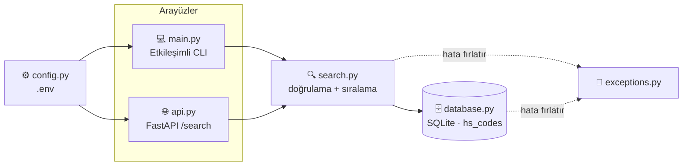
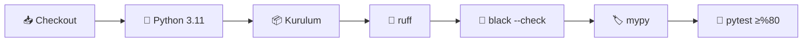

<div align="center">

# 🛃 CustomsIQ

### Gümrük ve dış ticaret operasyonları için uyum araç seti
**Sade bir ürün açıklamasını doğru HS / CN tarife koduna dönüştürün.**

[](https://github.com/Mutersec/CustomsIQ/actions/workflows/ci.yml)


[🇬🇧 English](README.md) · **🇹🇷 Türkçe** · [🇩🇪 Deutsch](README.de.md)

</div>

---

## 📑 İçindekiler

| | | |
|---|---|---|
| [🎯 Problem](#-problem) | [✨ Özellikler](#-özellikler) | [🏗️ Mimari](#️-mimari) |
| [🧠 Tasarım kararları](#-tasarım-kararları) | [⚙️ Kurulum](#️-kurulum) | [🚀 Kullanım](#-kullanım) |
| [🌐 API referansı](#-api-referansı) | [🧪 Kalite ve testler](#-kalite-ve-testler) | [📦 Örnek veri](#-örnek-veri) |
| [🗺️ Yol haritası](#️-yol-haritası) | [📁 Proje yapısı](#-proje-yapısı) | [📄 Lisans](#-lisans) |

---

## 🎯 Problem

Doğru **CN kodunu** (AB *Kombine Nomanklatür*'ü; uluslararası HS kodunu 8 haneye, TARIC'te ise
10 haneye genişletir) belirlemek, gümrük beyannamesi sürecinin en yavaş ve hataya en açık
adımlarından biridir. Bugün bu işlem, on binlerce satırlık tarife cetveli üzerinde elle
yapılmaktadır.

| Sorun | Ticari sonucu |
|---|---|
| 🔍 Devasa tarife cetvelinde elle arama | Beyan süreci yavaşlar; sonuç, o vardiyadaki operatöre göre değişir |
| ❌ Yanlış sınıflandırma | Hatalı vergi oranı, cezalar, gümrükte bekleyen sevkiyatlar |
| 🧠 Bilginin kişilere bağlı kalması | Yeni personelin adaptasyonu yavaşlar; seçilen kodun denetlenebilir gerekçesi olmaz |

**CustomsIQ ilk eleme adımını otomatikleştirir:** sade bir ürün açıklaması verirsiniz, benzerlik
skoruyla sıralanmış kısa bir tarife kodu listesi alırsınız — bu, uzmanın onaylayacağı bir başlangıç
noktasıdır; tek başına karar veren bir kara kutu değildir.

---

## ✨ Özellikler

| | Özellik | Açıklama |
|---|---|---|
| 🔍 | **Bulanık arama** | Serbest metin açıklama → benzerlik skoruna göre sıralanmış CN/TARIC kodları |
| 💻 | **Etkileşimli CLI** | Açıklamayı yazın, terminalde anında sıralı sonuç alın |
| 🌐 | **REST API** | FastAPI ile sunulan `GET /search` ve otomatik üretilen `/docs` arayüzü |
| 🗄️ | **Kurulum gerektirmeyen depolama** | Standart kütüphanedeki SQLite; 20 demo koduyla hazır gelir |
| ⚙️ | **Ortam tabanlı yapılandırma** | `pydantic-settings` `.env` dosyasını okur — sabit kodlanmış yol yok |
| 🚨 | **Tipli hatalar** | `InvalidQueryError`, `HSCodeNotFoundError` → temiz HTTP `400` / `404` semantiği |
| 🧪 | **Zorunlu kalite** | ruff + black + mypy + %97 kapsam; her push'ta CI tarafından denetlenir |

---

## 🏗️ Mimari

CLI ve HTTP API, **ortak tek bir `search()` fonksiyonunun ince birer adaptörüdür** — sıralama
mantığı tam olarak tek bir yerde bulunur ve asla tekrarlanmaz.



### Modül sorumlulukları

| Modül | Sorumluluk |
|---|---|
| `models.py` | `HSCode` — değişmez `(kod, açıklama, kategori)` kaydı |
| `database.py` | SQLite şeması, bağlantı, örnek veri, `fetch_all()`, `get_by_code()` |
| `search.py` | Sorgu doğrulama + `difflib` benzerlik sıralaması (**tek doğruluk kaynağı**) |
| `exceptions.py` | `CustomsIQError` → `InvalidQueryError`, `HSCodeNotFoundError` |
| `config.py` | `pydantic-settings`; `CUSTOMSIQ_*` ortam değişkenlerini ve `.env` dosyasını okur |
| `logging_config.py` | Ortak loglama kurulumu — stdout'a sade format, hiçbir yerde `print()` yok |
| `main.py` | Etkileşimli CLI giriş noktası |
| `api.py` | FastAPI uygulaması: `GET /` ve `GET /search` |

### Veri modeli

```sql
CREATE TABLE hs_codes (
    code        TEXT PRIMARY KEY,   -- örn. "6109100000"
    description TEXT NOT NULL,      -- örn. "Cotton T-shirts, knitted"
    category    TEXT NOT NULL       -- örn. "Textile"
);
```

---

## 🧠 Tasarım kararları

### Neden `rapidfuzz` / `thefuzz` yerine `difflib`?

`difflib.SequenceMatcher` Python ile birlikte gelir. Bu da **sıfır ek bağımlılık**, sürüm sabitleme
veya güvenlik denetimi derdi olmayan bir kurulum demektir — üstelik mevcut veri ölçeğinde fazlasıyla
yeterlidir.

| | `difflib` *(seçilen)* | `rapidfuzz` |
|---|---|---|
| **Bağımlılık** | ✅ Standart kütüphane | ⚠️ Üçüncü parti + C eklentisi |
| **~10² satırda hız** | ✅ Fark edilmez | ✅ Fark edilmez |
| **~10⁵ satırda hız** | ❌ Belirgin şekilde yavaş | ✅ C ile optimize, çok daha hızlı |
| **Kelime sırasına toleransı** | ❌ Yalnızca konumsal eşleştirme | ✅ `token_sort` / `token_set` skorlayıcıları |
| **Toplu işlem kapasitesi** | ❌ Saf Python | ✅ `process.extract`, çok çekirdekli |

### 🔀 Ne zaman geçilmeli

Aşağıdakilerden **herhangi biri** gerçekleştiğinde `search.py` içindeki `_similarity()` fonksiyonunu
`rapidfuzz.fuzz.WRatio` ile değiştirin:

1. **📈 Ölçek** — gerçek tarife cetveli (on binlerce satır) doğrusal taramayı ölçülebilir biçimde yavaşlattığında.
2. **🔤 Kelime sırası** — *"pantolon pamuklu erkek"* gibi sorguların *"Men's cotton trousers"* ile eşleşmesi gerektiğinde; konumsal eşleştirme bunu iyi yapamaz.
3. **⚡ İşlem hacmi** — toplu yeniden sınıflandırma işi saniyede binlerce sorgu gerektirdiğinde.

> Değişiklik **tek bir fonksiyonla** sınırlıdır; dolayısıyla bu, sonraya bırakılabilecek ucuz bir
> karardır — bugün verilmesi gereken bir tasarım taahhüdü değil.

### Diğer bilinçli tercihler

| Karar | Gerekçe | Yükseltme yolu |
|---|---|---|
| **Postgres değil SQLite** | Tek düğümlü, ağırlıklı okuma yapılan referans verisi; sıfır operasyon yükü | Çoklu yazar eşzamanlılığı gerektiğinde bağlantı katmanı değiştirilir |
| **`check_same_thread=False` ile tek paylaşımlı bağlantı** | Basit; FastAPI'nin thread havuzuyla çalışır | Eşzamanlı yazmalar ortaya çıktığında bağlantı havuzu |
| **`print()` değil loglama** | CLI ve API için aynı çıktı yolu; seviye yapılandırmayla kontrol edilir | — |
| **Doğrulamanın `search()` içinde olması** | Hem CLI hem API bunu devralır; yeni bir çağıran eklenerek atlanması imkânsızdır | — |

### 🇪🇺 AB uyumu

> Veri modeli ve terminoloji, hedef pazarı (AB merkezli ticaret uyum rolleri) yansıtacak şekilde AB
> Kombine Nomanklatürü ve AB ticaret uyum çerçeveleriyle hizalanmıştır.

Somut olarak bu şu anlama gelir:

| Konu | Doğruluk kaynağı |
|---|---|
| Tarife kodları ve nomanklatür | [AB TARIC veritabanı](https://ec.europa.eu/taxation_customs/dds2/taric) — CN-8 kodları, AB alt açılımlarıyla TARIC-10 |
| Yaptırım ve ambargo taraması | AB Konsolide Mali Yaptırımlar Listesi |
| Tercihli vergi oranları | AB ticaret anlaşmaları |

---

## ⚙️ Kurulum

```bash
# 1. Depoyu klonlayın
git clone https://github.com/Mutersec/CustomsIQ.git
cd CustomsIQ

# 2. Sanal ortam
python3 -m venv .venv
source .venv/bin/activate          # Windows: .venv\Scripts\activate

# 3. Bağımlılıklar
pip install -r requirements.txt

# 4. (İsteğe bağlı) yapılandırma
cp .env.example .env
```

### Yapılandırma

Tüm ayarlar ortam değişkenlerinden veya `.env` dosyasından okunur:

| Değişken | Varsayılan | Açıklama |
|---|---|---|
| `CUSTOMSIQ_DATABASE_PATH` | `customsiq.db` | SQLite dosya yolu (geçici veritabanı için `:memory:`) |
| `CUSTOMSIQ_LOG_LEVEL` | `INFO` | Python log seviyesi (`DEBUG`, `INFO`, `WARNING`, …) |

---

## 🚀 Kullanım

### 💻 Etkileşimli CLI

```bash
python -m src.customsiq.main
```

```text
seeded 20 HS code records
CustomsIQ - HS Code Search (type 'quit' to exit)

Product description: cotton t-shirt
1. 6109100000  (74%)  Cotton T-shirts, knitted        [Textile]
2. 6203420000  (57%)  Men's cotton trousers           [Textile]
3. 6204620000  (54%)  Women's cotton trousers         [Textile]
4. 6110200000  (42%)  Cotton pullovers and sweaters   [Textile]
5. 8528721000  (35%)  Color television receivers      [Electronics]
```

### 🌐 REST API

```bash
uvicorn src.customsiq.api:app --reload
```

Ardından etkileşimli Swagger arayüzü için **http://localhost:8000/docs** adresini açın.

```bash
curl "http://localhost:8000/search?q=cotton+t-shirt&limit=2"
```

```json
[
  {
    "code": "6109100000",
    "description": "Cotton T-shirts, knitted",
    "category": "Textile",
    "score": 0.7368421052631579
  },
  {
    "code": "6203420000",
    "description": "Men's cotton trousers",
    "category": "Textile",
    "score": 0.5714285714285714
  }
]
```

### 🐍 Kütüphane olarak

```python
from src.customsiq.database import get_connection, seed
from src.customsiq.search import search

conn = get_connection("customsiq.db")
seed(conn)

for result in search(conn, "lithium battery", limit=3):
    print(f"{result.hs_code.code}  {result.score:.0%}  {result.hs_code.description}")
```

---

## 🌐 API referansı

| Metot | Uç nokta | Açıklama |
|---|---|---|
| `GET` | `/` | Servis bilgisi — `{"service": "CustomsIQ API", "docs": "/docs", "status": "running"}` |
| `GET` | `/search` | Ürün açıklaması için sıralanmış CN kodu eşleşmeleri |
| `GET` | `/docs` | Etkileşimli Swagger arayüzü (otomatik üretilir) |

**`GET /search` parametreleri**

| Parametre | Tip | Varsayılan | Kısıtlar | Açıklama |
|---|---|---|---|---|
| `q` | `str` | *zorunlu* | 1–500 karakter, boş olamaz | Serbest metin ürün açıklaması |
| `limit` | `int` | `5` | 1–50 | Azami sonuç sayısı |

**Durum kodları**

| Kod | Anlamı |
|---|---|
| `200` | Başarılı — eşleşme dizisi (boş olabilir) |
| `400` | `InvalidQueryError` — boş sorgu veya 500 karakterden uzun |
| `422` | Eksik/geçersiz parametre tipi (FastAPI doğrulaması) |

---

## 🧪 Kalite ve testler

Her push ve pull request'te tüm kalite kapısı [GitHub Actions](.github/workflows/ci.yml) üzerinde çalışır:



```bash
ruff check .                                                  # lint
black .                                                       # biçimlendirme
mypy src                                                      # tip denetimi
pytest --cov --cov-report=term-missing --cov-fail-under=80    # testler + kapsam eşiği
```

### Güncel test kapsamı

| Modül | Kapsam |
|---|---|
| `api.py` · `config.py` · `database.py` | 🟢 %100 |
| `exceptions.py` · `logging_config.py` · `models.py` · `search.py` | 🟢 %100 |
| `main.py` | 🟢 %90 |
| **Toplam** | **🟢 %97,5** (20 test, eşik %80) |

### Test edilen uç durumlar

| Durum | Beklenen davranış |
|---|---|
| Boş / yalnızca boşluktan oluşan sorgu | `InvalidQueryError` → HTTP `400` |
| 500 karakterden uzun sorgu | `InvalidQueryError` → HTTP `400` |
| SQL injection biçimli girdi (`'; DROP TABLE hs_codes; --`) | Parametreli sorgularla güvenle işlenir; tablo bozulmaz |
| Emoji ve ASCII dışı girdi (`📱 telefon şarj aleti`) | Normal şekilde skorlanır, çökme olmaz |
| Bilinmeyen kodun birebir sorgulanması | `HSCodeNotFoundError` |
| Dolu veritabanının yeniden doldurulması | Idempotent — mükerrer kayıt oluşmaz |

---

## 📦 Örnek veri

Veritabanı, AB Kombine Nomanklatür biçiminde yazılmış **8 kategoriye yayılmış 20 temsili CN/TARIC
koduyla** doldurulur:

| Kategori | Kod sayısı |
|---|---|
| 📱 Elektronik | 5 |
| 👕 Tekstil | 5 |
| 🍫 Gıda | 5 |
| 💊 İlaç · 🚗 Otomotiv · 🪑 Mobilya · 🧴 Plastik · 🔩 Metal | her biri 1 |

<details>
<summary><b>20 kaydın tamamını göster</b></summary>

| CN/TARIC kodu | Açıklama | Kategori |
|---|---|---|
| `8517120000` | Cep telefonları ve akıllı telefonlar | Elektronik |
| `8471300000` | Taşınabilir otomatik bilgi işlem makineleri (dizüstü) | Elektronik |
| `8528721000` | Renkli televizyon alıcıları | Elektronik |
| `8544421000` | USB kabloları ve veri kabloları | Elektronik |
| `8507600000` | Lityum iyon piller | Elektronik |
| `6109100000` | Pamuklu tişörtler, örme | Tekstil |
| `6203420000` | Erkek pamuklu pantolonlar | Tekstil |
| `6204620000` | Kadın pamuklu pantolonlar | Tekstil |
| `6110200000` | Pamuklu kazak ve süveterler | Tekstil |
| `6402990000` | Kauçuk veya plastik tabanlı ayakkabılar | Tekstil |
| `0901210000` | Kavrulmuş kahve, kafeini alınmamış | Gıda |
| `1806320000` | Çikolata blokları, dolgusuz | Gıda |
| `2009110000` | Dondurulmuş portakal suyu | Gıda |
| `0406100000` | Taze peynir | Gıda |
| `1905310000` | Tatlı bisküviler | Gıda |
| `3004900000` | Tedavi amaçlı ilaçlar | İlaç |
| `4011100000` | Otomobiller için yeni dış lastikler | Otomotiv |
| `9403300000` | Ahşap büro mobilyaları | Mobilya |
| `3926909700` | Plastik ev eşyaları | Plastik |
| `7326909800` | Demir veya çelikten muhtelif eşya | Metal |

</details>

> ⚠️ Bu veriler geliştirme ve test amaçlı **demo verilerdir**. Üretim kullanımı için
> [AB TARIC veritabanındaki](https://ec.europa.eu/taxation_customs/dds2/taric) resmî nomanklatür
> gereklidir.

---

## 🗺️ Yol haritası

CN arama modülü bugün kullanıma hazırdır. Üç uyum modülü daha iskelet hâlinde yer alıyor ve
uygulanmayı bekliyor — gerçek bir mantık içermedikleri sürece kapsam eşiğinin dışında tutulurlar:

| Modül | Durum | Planlanan kapsam |
|---|---|---|
| `search.py` + `api.py` | ✅ **Tamamlandı** | CLI ve REST üzerinden bulanık CN kodu araması |
| `cn_classifier.py` | 🚧 İskelet | AB TARIC veri kümesine karşı kural ve güven skoru tabanlı sınıflandırma |
| `tariff_calculator.py` | 🚧 İskelet | Vergi hesaplama, menşe kuralları, AB tercihli ticaret anlaşması oranları |
| `embargo_screener.py` | 🚧 İskelet | AB Konsolide Mali Yaptırımlar Listesi'ne karşı tarama |

---

## 📁 Proje yapısı

```text
CustomsIQ/
├── .github/workflows/ci.yml     # ruff → black → mypy → pytest
├── src/
│   ├── customsiq/
│   │   ├── models.py            # HSCode kaydı
│   │   ├── database.py          # SQLite katmanı + örnek veri
│   │   ├── search.py            # doğrulama + benzerlik sıralaması
│   │   ├── exceptions.py        # tipli hata hiyerarşisi
│   │   ├── config.py            # pydantic-settings / .env
│   │   ├── logging_config.py    # ortak loglama kurulumu
│   │   ├── main.py              # CLI giriş noktası
│   │   ├── api.py               # FastAPI uygulaması
│   │   ├── cn_classifier.py     # 🚧 iskelet
│   │   ├── tariff_calculator.py # 🚧 iskelet
│   │   └── embargo_screener.py  # 🚧 iskelet
│   └── utils/validators.py      # CN/TARIC format ve ülke kodu doğrulaması
├── tests/                       # 20 test — birim, API, CLI, uç durumlar
├── pyproject.toml               # ruff · black · mypy · pytest · coverage
├── requirements.txt
└── .env.example
```

---

## 📄 Lisans

**MIT Lisansı** ile yayımlanmıştır.

<div align="center">

[🇬🇧 English](README.md) · **🇹🇷 Türkçe** · [🇩🇪 Deutsch](README.de.md)

</div>
